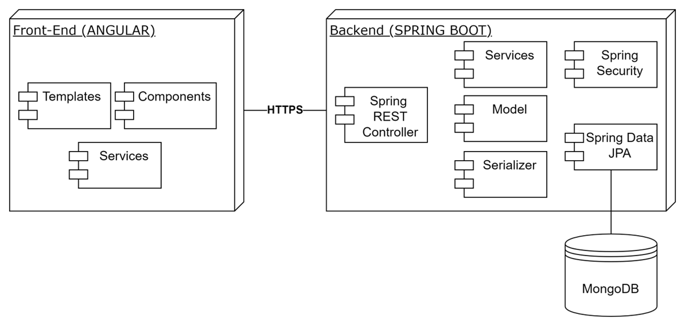
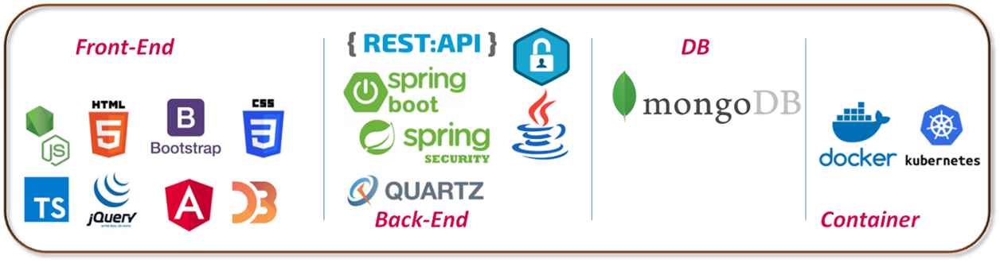
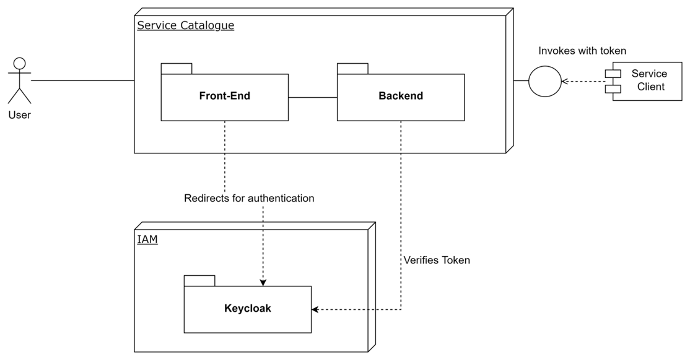
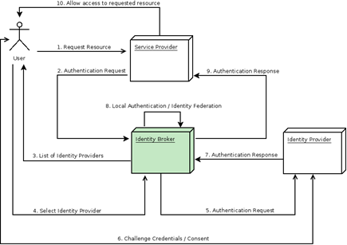

# Service Catalogue

Service Catalogue provides all functionality to register, model, map and publish and manage all the information needed to support the uses of service (public&private) according to the following three points of view:

- Informational
- Service Invocation
- Semantic interoperability & Personal Data Governance

The catalogue enables the storage and publishing of service by providing general, technical and data processing information based on standard models ( e.g. [ISA2 CPSV-AP](https://joinup.ec.europa.eu/collection/semantic-interoperability-community-semic/solution/core-public-service-vocabulary-application-profile/about) ).

Service Catalogue is an open source software developed by
[Engineering Ingegneria Informatica SpA](http://www.eng.it) inside the EU founded project [ACROSS](https://across-h2020.eu/).

| :books: [Documentation](https://service-catalogue.readthedocs.io/) | :whale: [Docker Hub](https://hub.docker.com/u/capesuite)|
|---|---|

# Table of Contents
1. [Introduction](#introduction)
2. [Installation](#installation)
3. [Usage](#usage)
4. [API](#api)
5. [License](#license)
6. [Libraries](#libraries)

--------------------

## Introduction

The Service Catalogue is a layered application implementing the Service Registry (front-end and backend) and Metadata Catalogue features, to provide APIs for programmatically interaction with other components of ACROSS platform and dashboards and a graphical editors supporting users to manage service descriptions and related [Service Model](./docs/model/index.md) adaptation.

The Backend is implemented as [Spring
Boot](https://spring.io/projects/spring-boot) Java microservice, and
will be deployed with a tightly coupled storage service
([MongoDB](https://www.mongodb.com/) 4.2+). The Front-end,named Service Catalogue Manager, is an Angular
portal based on [Nebular](https://akveo.github.io/nebular/) framework.

The two layers can be deployed as [Docker](https://www.docker.com/)
containers, based on [Tomcat Alpine
image](https://hub.docker.com/_/tomcat) and paired with a MongoDB
container. This adoption of several reliable and production ready
technologies guarantees robustness and modularity of the solution.

Service Catalogue architecture implementation is completed by
integrating Spring Security and [Keycloak](https://www.keycloak.org/)
that supports [OpenId Connect](https://openid.net/connect/) and
[OAuth2](https://oauth.net/2/) authorization framework. The Service
Catalogue uses the Open Id Connect protocol upon the OAuth2
Authorization workflows, in order to perform User authentication and
obtain an Access Token (JWT), which will be used to grant access.

Similarly, a client application/service wanting to interact with the
Service Catalogue, will perform OAuth2 Authorization, obtaining an
Access Token to be used in the request to APIs.The choice of Keycloak
provides an out of box solution for a rapid security layer development
of application with supporting features such as Single-Sign-On (SSO),
Social Login, User Federation, Client Adapters, Admin Console and
Account Management Console and finally [Identity
Brokering](https://www.keycloak.org/docs/latest/server_admin/#_identity_broker)

This last aspect will facilitate the integration of the Service Catalogue with multiple and specific identity Systems.

## Installation
The instruction to install Service Catalogue modules can be found at the corresponding [install](./docs/install/index.md) section

## Usage

The User Guide for Service Catalogue Manager can be found at the corresponding [usage](./docs/usage/index.md) section

## API
The Service Catalogue APIs Introduction can be found at the corresponding section of
[API](./docs/api/index.md).

## Support / Contact

Any feedback on this documentation is highly welcome, including bugs, typos and suggestions. You can use GitHub [issues](https://github.com/OPSILab/Service-Catalogue/issues)
to provide feedback.

##### Contacts

-   Vincenzo Savarino: [_vincenzo.savarino@eng.it_](mailto:vincenzo.savarino@eng.it)

---

## License

Service Catalogue is licensed under [AGPLv3 License](./LICENSE).

---
## Libraries

Service Catalogue Suite uses following libraries and frameworks.

| Name                                                                                    | Version       | License                           |
|-----------------------------------------------------------------------------------------|---------------|-----------------------------------|
| [Spring Boot](https://spring.io/projects/spring-boot)                                   | 2.4.5         | Apache License 2.0                |
| [Springdoc Openapi](https://springdoc.org)                                              | 1.5.8         | Apache License 2.0                |
| [Spring Data](https://spring.io/projects/spring-data)                                   | 2.4.5         | Apache License 2.0                |
| [Lombok](https://projectlombok.org/)                                                    | 1.18.12       | MIT                               |
| [Apache Commong Lang 3](https://commons.apache.org)                                     | 3.11          | Apache License 2.0                |
| [JSONSchema2Pojo Plugin](http://jsonschema2pojo.org)                                    | 1.01          | Apache License 2.0                |
| [Angular](angular.io)                                                                   | 11.2.12       | MIT                               |
| [Nebular](https://akveo.github.io/nebular)                                              | 7.0.0         | MIT                               |
| [Json-Editor](https://github.com/json-editor/json-editor)                               | 2.8.0         | MIT                               |
| [Bootstrap](https://getbootstrap.com )                                                  | 4.6.0         | MIT                               |
| [Ngx-configure](https://github.com/catrielmuller/ngx-configure)                         | 9.0.0         | ISC License                       |
| [Ng2-smart-table](https://akveo.github.io/ng2-smart-table)                              | 1.7.2         | MIT                               |
| [Rxjs](https://rxjs.dev/guide/overview)                                                 | 6.6.7         | Apache License 2.0                |
| [Ngx-translate](http://www.ngx-translate.com/)                                          | 13.0.0        | MIT                               |
| [TypeScript](https://www.typescriptlang.org)                                            | 4.1.5         | Apache License 2.0                |
| [jQuery](jquery.com)                                                                    | 3.5.1         | MIT                               |
| [D3](https://d3js.org)                                                                  | 6.6.2         | BSD                               |
| [Material-design-icons](https://github.com/google/material-design-icons)                | 3.0.1         | Apache License 2.0                |
| [Fontawesome-free](https://fontawesome.com)                                             | 5.15.3        | CC-BY-4.0                         |
| [Fontawesome-svg-core](https://www.npmjs.com/package/@fortawesome/fontawesome-svg-core) | 1.2.35        | MIT                               |                                                                  |               |                                   |
| [Java OpenJDK](https://openjdk.java.net/)                                                                      | >= 15                 | GNU General Public License Version 2.0  |
| [Apache Tomcat](https://tomcat.apache.org)                                                                     | >=9.0                | Apache License v.2.0                    |
| [MongoDB Community Server](www.mongodb.com)                                                                    | >=4.2.9              | Server Side Public License (SSPL)       |
| [Maven](https://maven.apache.org)                                                                              | >=3.5.0              | Apache License 2.0                      |
---

### External Components

Service Catalogue uses the [Keycloak IdM](https://www.keycloak.org/) (Apache License 2.0).

---

© 2021-2023 Engineering Ingegneria Informatica S.p.A.
