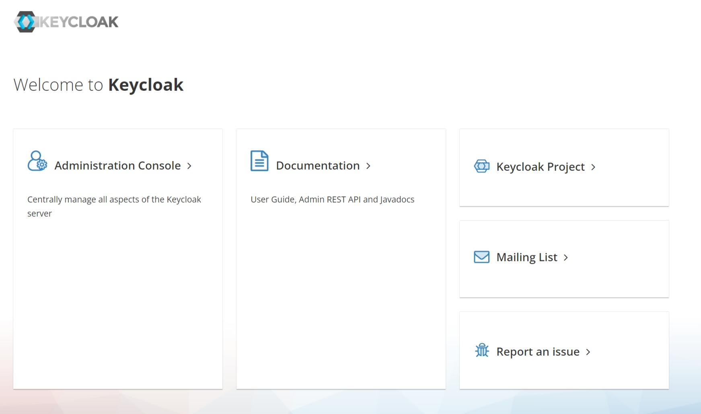

# Welcome to the Service Catalogue Installation Manual!

This section provides the description of the installation and administration functionalities. An
administrator should be able to install, deploy, perform the sanity checks on
the environment.

###Get the source code from repository

Open a command prompt and execute the following command to clone the source code
from the CaPe [GitHub](https://github.com/OPSILab/Service-Catalogue.git) repository ([Git](https://git-scm.com/downloads) must be installed):

```bash
git clone https://github.com/OPSILab/Service-Catalogue.git
```


```bash
cd Service-Catalogue
```


---

### Install Service Catalogue components
Service Catalogue installation will involve the deployment of different architectural components, each of which can deployed either in a "on premise", "as a service" or mixed approach:

  - [**Service Catalogue Server**](install-sc-server.md)
  - [**Service Catalogue Manager**](install-sc-manager.md)
  
 

---
## Libraries

Service Catalogue uses following libraries and frameworks.

| Name                                                                                    | Version       | License                           |
|-----------------------------------------------------------------------------------------|---------------|-----------------------------------|
| [Spring Boot](https://spring.io/projects/spring-boot)                                   | 2.4.5         | Apache License 2.0                |
| [Springdoc Openapi](https://springdoc.org)                                              | 1.5.8         | Apache License 2.0                |
| [Spring Data](https://spring.io/projects/spring-data)                                   | 2.4.5         | Apache License 2.0                |
| [Lombok](https://projectlombok.org/)                                                    | 1.18.12       | MIT                               |
| [Apache Commong Lang 3](https://commons.apache.org)                                     | 3.11          | Apache License 2.0                |
| [JSONSchema2Pojo Plugin](http://jsonschema2pojo.org)                                    | 1.01          | Apache License 2.0                |
| [Angular](angular.io)                                                                   | 11.2.12       | MIT                               |
| [Nebular](https://akveo.github.io/nebular)                                              | 7.0.0         | MIT                               |
| [Json-Editor](https://github.com/json-editor/json-editor)                               | 2.8.0         | MIT                               |
| [Bootstrap](https://getbootstrap.com )                                                  | 4.6.0         | MIT                               |
| [Ngx-configure](https://github.com/catrielmuller/ngx-configure)                         | 9.0.0         | ISC License                       |
| [Ng2-smart-table](https://akveo.github.io/ng2-smart-table)                              | 1.7.2         | MIT                               |
| [Rxjs](https://rxjs.dev/guide/overview)                                                 | 6.6.7         | Apache License 2.0                |
| [Ngx-translate](http://www.ngx-translate.com/)                                          | 13.0.0        | MIT                               |
| [TypeScript](https://www.typescriptlang.org)                                            | 4.1.5         | Apache License 2.0                |
| [jQuery](jquery.com)                                                                    | 3.5.1         | MIT                               |
| [D3](https://d3js.org)                                                                  | 6.6.2         | BSD                               |
| [Material-design-icons](https://github.com/google/material-design-icons)                | 3.0.1         | Apache License 2.0                |
| [Fontawesome-free](https://fontawesome.com)                                             | 5.15.3        | CC-BY-4.0                         |
| [Fontawesome-svg-core](https://www.npmjs.com/package/@fortawesome/fontawesome-svg-core) | 1.2.35        | MIT                               |                                                                  |               |                                   |
| [Java OpenJDK](https://openjdk.java.net/)                                                                      | >= 15                 | GNU General Public License Version 2.0  |
| [Apache Tomcat](https://tomcat.apache.org)                                                                     | >=9.0                | Apache License v.2.0                    |
| [MongoDB Community Server](www.mongodb.com)                                                                    | >=4.2.9              | Server Side Public License (SSPL)       |
| [Maven](https://maven.apache.org)                                                                              | >=3.5.0              | Apache License 2.0
| [JsonEditor](https://www.npmjs.com/package/jsoneditor)                                                                              | 9.10.0              | Apache License 2.0                      |
| [Lodash](https://www.npmjs.com/package/lodash)                                                                              | 4.17.21              | MIT                      |

---

<a name="identity-manager"></a>
## Identity and Access Manager

Service Catalogue  interacts with any Identity Manager that supports [OpenId Connect](https://openid.net/connect/) authorization framework.

**Note.** Service Catalogue uses the [Keycloak IdM](https://www.keycloak.org/) as default, which will be used as reference for the configuration sections of this installation guide.

Service Catalogue Manager will use the Open Id Connect protocol upon the OAuth2 Authentication workflow (Authorization Code grant), in order to perform User authentication and obtain an Access Token (JWT), which will be used to grant access to Service Catalogue APIs. 

This Access Token will be used by the Service Catalogue Manager dashboard to call the APIs exposed  by **Service Catalogue Server** component.

In the same way, an external client application/service that wants to interact with Service Catalogue APIs must perform one of the available OAuth2 flows (Authorization Code, Client Credentials and Password grants) against the IdM (e.g. Keycloak), in order to get an Access Token and then use it in the API requests. In that case, you must enable oauth2 authentication and create a client id and a client secret in order to allow remote access for federated query (see [Federation](../usage/federation-how-to.md))

### Keycloak Identity Manager installation

The default theme proposed by the Keycloak server has been customized (brand) for the specific application; in this way it was possible to have a specific look and feel for the end-user facing Keycloak administration console, login, welcome page, emails, and for the user's profile page.

keycloak-console.jpg


Keycloak provides an administration console that is used to manage realms. Within each realm it is possible, for an administrator, to register users and client applications managing roles and their associations with the users.


In order to get Keycloak ready to be used by Service Catalogue, following steps must be performed:

 - Install Keycloak, create a realm and at least one user [(see here)](https://www.keycloak.org/getting-started/getting-started-docker).
 - Register a client applications with a name and clientId [(see here)](https://www.keycloak.org/docs/latest/server_admin/#_clients). Be sure to select `public` in the Access Type field.
 - Create  `DATA_CONTROLLER`, `SERVICE_MANAGER` and `CATALOGUE_MANAGER`
 in the  client. [(see here)](https://www.keycloak.org/docs/latest/server_admin/#client-roles).
 - Assign  `SERVICE_MANAGER` as default role. [(see here)](https://www.keycloak.org/docs/latest/server_admin/#_default_roles).

 - Create at least a user playing the above third roles in order to view all the sections of the  [Service Catalogue Manager Dashboard](../usage/index.md)

 - Create for client a Mapper of type User Client Role and set `roles` as Token Claim Name, in order to map client roles to the `roles` field of the generated Access Token. 

  - Enable oauth2 authentication and create a client id and a client secret in order to allow remote access for federated query (see [Federation](../usage/federation-how-to.md)). 

---

Any feedback on this documentation is highly welcome, including bug reports and
suggestions. Please send the feedback through
[GitHub](https://github.com/OPSILab/Service-Catalogue). Thanks!

