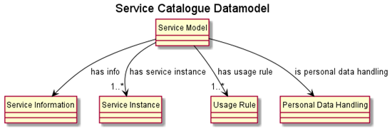

# Service Catalogue Model 

## Introduction

In order to support a uniform and harmonized machine-readable
description of public and private services a service model has been
defined to collect all information from the three point of view
(Informational, Service invocation, Data Governance&Ownership) and
managed in the Service Catalogue. The idea is to define this model by
including and extending existing common models to describe each view.



**Information View** provides all information metadata of a service.
This section follows the CPSV-AP, the [Core Public Service Vocabulary
Application
Profile](https://joinup.ec.europa.eu/collection/semic-support-centre/solution/core-public-service-vocabulary-application-profile/release/310),
a data model provided by the ISA2 Programme that is the result of a
joint effort from different public administrations to reduce
interoperability barriers.

**Usage Rule and Personal Data Handling views** capture information
about for handling data access rights. In particular the personal Data
Handling section is a specialized profile of the [Data Privacy
Vocabulary (DPV)](https://dpvcg.github.io/dpv/) providing terms (classes
and properties) to describe and represent information about personal
data handling. In particular, the vocabulary provides extensible
taxonomies of terms to describe the following components:

-   Personal Data Categories

-   Purposes

-   Processing Categories

-   Technical and Organisational Measures

-   Legal Basis such as Consent

-   Entities such as Recipients, Data Controllers, Data Subjects

The **Service Instance view** provides all operational information to
manage and invoke each service instance

The following sections provides a deeper description of the ACROSS
Service Model.

## Service Basic Info

Each service to be registered in the Service Catalogue has to provide
some basic information.

Each service to be registered in the Service Catalogue has to provide
some basic information.


Property                   | Type           | Description
  ---------------------------| ---------------| ---------------------------------------
  title          |             String(1..1)   | Service Name
  identifier|String(1..1)|Id of service or service URI if exists.                                               This identifier will be used by the  Service Catalogue to identify it and could be the same identifier provided in the information section.
  issued   |                    String(0..1)|    When Service entry was created (system log data) 
  createdByUserId|             String 0..1)|    User Id (if any)of Service Editor
  serviceDescriptionVersion|   String(0..1) |   Service description version number
  serviceIconUrl|              String(0..1)|    URL pointing to service's icon (if available)
  status |                     String(0..1)|    Status of Service [Completed,      Deprecated, UnderDevelopment,WithDrawn]
  isPublicService |            Boolean(1..1)|   If service is public or not
  hasInfo  |                   Object(1..1) |   Object describing Service informationsection.
  hasServiceInstance |         Object(1..1)|    Object describing Service information  section.
  isPersonalDataHandling |     Object(1..n)|    Object describing Personal data                                     handling.
  hasUsageRule |               Object(1..n)|    Object describing Service usage Rules.


## Service Information section

Each service should provide basic information, identification, service
classifications and locale descriptions. Such classifications are only
related to public services, according to ISA² Core Public Service
Vocabulary Application Profile (CPSV-AP). The following classes and
properties belong to ISA² CPSV-AP v2.2.1.

<table border="1" cellspacing="0" cellpadding="0" width="100%">
    <tbody>
        <tr>
            <td width="13%" valign="top">
                <p>
                    Property
                </p>
            </td>
            <td width="37%" valign="top">
                <p>
                    Type
                </p>
            </td>
            <td width="48%" valign="top">
                <p>
                    Description
                </p>
            </td>
        </tr>
        <tr>
            <td width="13%" valign="top">
                <p>
                    Title
                </p>
            </td>
            <td width="37%" valign="top">
                <p>
                    String(1..1)
                </p>
            </td>
            <td width="48%" valign="top">
                <p>
                    It represents the official Name of the Public Service
                </p>
            </td>
        </tr>
        <tr>
            <td width="13%" valign="top">
                <p>
                    Identifier
                </p>
            </td>
            <td width="37%" valign="top">
                <p>
                    String(1..1)
                </p>
            </td>
            <td width="48%" valign="top">
                <p>
                    This property represents a formally-issued Identifier for
                    the Public Service.
                </p>
            </td>
        </tr>
        <tr>
            <td width="13%" valign="top">
                <p>
                    Description
                </p>
            </td>
            <td width="37%" valign="top">
                <p>
                    Object(1..N)
                </p>
            </td>
            <td width="48%" valign="top">
                <p>
                    This property represents a free text Description of the
                    Public Service. The description is likely to be the text
                    that potential users of the Public Service see in any
                    public service catalogue.
                </p>
                <table border="1" cellspacing="0" cellpadding="0">
                    <tbody>
                        <tr>
                            <td valign="top">
                                <p>
                                    <strong><em>Property</em></strong>
                                </p>
                            </td>
                            <td valign="top">
                                <p>
                                    <strong><em>Type</em></strong>
                                </p>
                            </td>
                            <td valign="top">
                                <p>
                                    <strong><em>Description</em></strong>
                                </p>
                            </td>
                        </tr>
                        <tr>
                            <td valign="top">
                                <p>
                                    <strong>locale</strong>
                                </p>
                            </td>
                            <td valign="top">
                                <p>
                                    string
                                </p>
                            </td>
                            <td valign="top">
                                <p>
                                    Language used in
                                </p>
                                <p>
                                    information, ISO
                                </p>
                                <p>
                                    639-1 coded
                                </p>
                            </td>
                        </tr>
                        <tr>
                            <td valign="top">
                                <p>
                                    <strong>description</strong>
                                </p>
                            </td>
                            <td valign="top">
                                <p>
                                    string
                                </p>
                            </td>
                            <td valign="top">
                                <p>
                                    Textual description
                                </p>
                            </td>
                        </tr>
                        <tr>
                            <td valign="top">
                                <p>
                                    <strong>title</strong>
                                </p>
                            </td>
                            <td valign="top">
                                <p>
                                    string
                                </p>
                            </td>
                            <td valign="top">
                                <p>
                                    Localized label name 
                                </p>
                            </td>
                        </tr>
                        <tr>
                            <td width="96" valign="top">
                                <p>
                                    <strong>keywords</strong>
                                </p>
                            </td>
                            <td width="89" valign="top">
                                <p>
                                    Array[String]
                                </p>
                            </td>
                            <td width="227" valign="top">
                                <p>
                                    Keyword tags related to textual
                                    description.
                                </p>
                            </td>
                        </tr>
                    </tbody>
                </table>
            </td>
        </tr>
        <tr>
            <td width="13%" valign="top">
                <p>
                    Keyword
                </p>
            </td>
            <td width="37%" valign="top">
                <p>
                    String(0..n)
                </p>
            </td>
            <td width="48%" valign="top">
                <p>
                    This property represents a keyword, term or phrase to
                    describe the Public Service.
                </p>
            </td>
        </tr>
        <tr>
            <td width="13%" valign="top">
                <p>
                    Sector
                </p>
            </td>
            <td width="37%" valign="top">
                <p>
                    String(0..n)
                </p>
            </td>
            <td width="48%" valign="top">
                <p>
                    This property represents the industry or sector a Public
                    Service relates to, or is intended for. For example:
                    environment, safety, housing. Note that a single Public
                    Service may relate to multiple sectors. The possible values
                    for this property are provided as a controlled vocabulary.
                    See section 4 in [2].
                </p>
            </td>
        </tr>
        <tr>
            <td width="13%" valign="top">
                <p>
                    Thematic Area
                </p>
            </td>
            <td width="37%" valign="top">
                <p>
                    String(0..n)
                </p>
            </td>
            <td width="48%" valign="top">
                <p>
                    This property represents the Thematic Area of a Public
                    Service as described in a controlled vocabulary, for
                    instance social protection, health, recreation, culture and
                    religion, family, travelling economic affairs, tax, staff,
                    environment. The recommended controlled vocabularies are
                    listed in section 4 in [2].
                </p>
            </td>
        </tr>
        <tr>
            <td width="13%" valign="top">
                <p>
                    Type
                </p>
            </td>
            <td width="37%" valign="top">
                <p>
                    String(0..n)
                </p>
            </td>
            <td width="48%" valign="top">
                <p>
                    This property represents the Type of a Public Service as
                    described in a controlled vocabulary. For the indicating
                    the Type, we are referring to the functions of government
                    to indicate the purpose of a government activity, which the
                    public service is intended for. The recommended controlled
                    vocabularies are listed in section 4 in [2].
                </p>
            </td>
        </tr>
        <tr>
            <td width="13%" valign="top">
                <p>
                    Language
                </p>
            </td>
            <td width="37%" valign="top">
                <p>
                    String(0..n)
                </p>
            </td>
            <td width="48%" valign="top">
                <p>
                    This property represents the language(s) in which the
                    Public Service is available. This could be one language or
                    multiple languages, for instance in countries with more
                    than one official language. The possible values for this
                    property are described in a controlled vocabulary. The
                    recommended controlled vocabularies are listed in section 4
                    in [2].
                </p>
            </td>
        </tr>
        <tr>
            <td width="13%" valign="top">
                <p>
                    Status
                </p>
            </td>
            <td width="37%" valign="top">
                <p>
                    String(0..1)
                </p>
            </td>
            <td width="48%" valign="top">
                <p>
                    Indicates whether a Public Service is active, inactive,
                    under development etc. according to a controlled
                    vocabulary.
                </p>
            </td>
        </tr>
        <tr>
            <td width="13%" valign="top">
                <p>
                    Is Grouped By
                </p>
            </td>
            <td width="37%" valign="top">
                <p>
                    String(0..1)
                </p>
            </td>
            <td width="48%" valign="top">
                <p>
                    This property links the Public Service to the Event class
                    of CPSV-AP model . Several Public Services may be
                    associated with a particular Event and, likewise, the same
                    Public Service may be associated with several different
                    Events.
                </p>
            </td>
        </tr>
        <tr>
            <td width="13%" valign="top">
                <p>
                    Requires
                </p>
            </td>
            <td width="37%" valign="top">
                <p>
                    String(0..n)
                </p>
            </td>
            <td width="48%" valign="top">
                <p>
                    One Public Service may require, or in some way make use of,
                    the output of one or several other Public Services. In this
                    case, for a Public Service to be executed, another Public
                    Service must be executed beforehand.
                </p>
            </td>
        </tr>
        <tr>
            <td width="13%" valign="top">
                <p align="left">
                    Has Competent Authority
                </p>
            </td>
            <td width="37%" valign="top">
                <p>
                    Object(1..1)
                </p>
            </td>
            <td width="48%" valign="top">
                <p>
                    This property links a Public Service to a Public
                    Organization, which is the responsible Agent for the
                    delivery of the Public Service. Whether the particular
                    Public Organization provides the public service directly or
                    outsources it is not relevant. The Public Organization that
                    is the Competent Authority of the service is the one that
                    is ultimately responsible for managing and providing the
                    public service. The CPSV-AP reuses the Core Public
                    Organisation Vocabulary that defines the concept of a
                    Public Organization and associated properties and
                    relationships.
                </p>
                <table border="1" cellspacing="0" cellpadding="0" width="100%">
                    <tbody>
                        <tr>
                            <td width="33%" valign="top">
                                <p>
                                    <strong><em>Property</em></strong>
                                </p>
                            </td>
                            <td width="19%" valign="top">
                                <p>
                                    <strong><em>Type</em></strong>
                                </p>
                            </td>
                            <td width="47%" valign="top">
                                <p>
                                    <strong><em>Description</em></strong>
                                </p>
                            </td>
                        </tr>
                        <tr>
                            <td width="33%" valign="top">
                                <p>
                                    <strong>identifier</strong>
                                </p>
                            </td>
                            <td width="19%" valign="top">
                                <p>
                                    String
                                </p>
                            </td>
                            <td width="47%" valign="top">
                                <p>
                                    Public Organization identifier
                                </p>
                            </td>
                        </tr>
                        <tr>
                            <td width="33%" valign="top">
                                <p>
                                    <strong>title</strong>
                                </p>
                            </td>
                            <td width="19%" valign="top">
                                <p>
                                    String
                                </p>
                            </td>
                            <td width="47%" valign="top">
                                <p>
                                    Name of Public Organization
                                </p>
                            </td>
                        </tr>
                        <tr>
                            <td width="33%" valign="top">
                                <p>
                                    <strong>hasAddress</strong>
                                </p>
                            </td>
                            <td width="19%" valign="top">
                                <p>
                                    String
                                </p>
                            </td>
                            <td width="47%" valign="top">
                                <p>
                                    Address
                                </p>
                            </td>
                        </tr>
                        <tr>
                            <td width="33%" valign="top">
                                <p>
                                    <strong>prefLabel</strong>
                                </p>
                            </td>
                            <td width="19%" valign="top">
                                <p>
                                    String
                                </p>
                            </td>
                            <td width="47%" valign="top">
                                <p>
                                    Preferred Label
                                </p>
                            </td>
                        </tr>
                        <tr>
                            <td width="33%" valign="top">
                                <p>
                                    <strong>spatial</strong>
                                </p>
                            </td>
                            <td width="19%" valign="top">
                                <p>
                                    String
                                </p>
                            </td>
                            <td width="47%" valign="top">
                                <p>
                                    Localization
                                </p>
                            </td>
                        </tr>
                    </tbody>
                </table>
            </td>
        </tr>
        <tr>
            <td width="13%" valign="top">
                <p>
                    Has Input
                </p>
            </td>
            <td width="37%" valign="top">
                <p>
                    Object(0..n)
                </p>
            </td>
            <td width="48%" valign="top">
                <p>
                    The Has Input property links a Public Service to one or
                    more instances of the Evidence class. A specific Public
                    Service may require the presence of certain pieces of
                    Evidence in order to be delivered.
                </p>
                <table border="1" cellspacing="0" cellpadding="0" width="100%">
                    <tbody>
                        <tr>
                            <td width="33%" valign="top">
                                <p>
                                    <strong><em>Property</em></strong>
                                </p>
                            </td>
                            <td width="19%" valign="top">
                                <p>
                                    <strong><em>Type</em></strong>
                                </p>
                            </td>
                            <td width="47%" valign="top">
                                <p>
                                    <strong><em>Description</em></strong>
                                </p>
                            </td>
                        </tr>
                        <tr>
                            <td width="33%" valign="top">
                                <p>
                                    <strong>identifier</strong>
                                </p>
                            </td>
                            <td width="19%" valign="top">
                                <p>
                                    String
                                </p>
                            </td>
                            <td width="47%" valign="top">
                                <p>
                                    Identifier ( URI if available)
                                </p>
                            </td>
                        </tr>
                        <tr>
                            <td width="33%" valign="top">
                                <p>
                                    <strong>title</strong>
                                </p>
                            </td>
                            <td width="19%" valign="top">
                                <p>
                                    String
                                </p>
                            </td>
                            <td width="47%" valign="top">
                                <p>
                                    Assigned Name
                                </p>
                            </td>
                        </tr>
                        <tr>
                            <td width="33%" valign="top">
                                <p>
                                    <strong>type</strong>
                                </p>
                            </td>
                            <td width="19%" valign="top">
                                <p>
                                    String
                                </p>
                            </td>
                            <td width="47%" valign="top">
                                <p>
                                    Category of input
                                </p>
                            </td>
                        </tr>
                        <tr>
                            <td width="33%" valign="top">
                                <p>
                                    <strong>language</strong>
                                </p>
                            </td>
                            <td width="19%" valign="top">
                                <p>
                                    String
                                </p>
                            </td>
                            <td width="47%" valign="top">
                                <p>
                                    Language
                                </p>
                            </td>
                        </tr>
                        <tr>
                            <td width="33%" valign="top">
                                <p>
                                    <strong>description</strong>
                                </p>
                            </td>
                            <td width="19%" valign="top">
                                <p>
                                    Object
                                </p>
                            </td>
                            <td width="47%" valign="top">
                                <p>
                                    Object describing localized description ( locale, description, title)
                                </p>
                            </td>
                        </tr>
                        <tr>
                            <td width="33%" valign="top">
                                <p>
                                    <strong>page</strong>
                                </p>
                            </td>
                            <td width="19%" valign="top">
                                <p>
                                    String (0..n)
                                </p>
                            </td>
                            <td width="47%" valign="top">
                                <p>
                                    Documentation
                                </p>
                            </td>
                        </tr>
                        <tr>
                            <td width="33%" valign="top">
                                <p>
                                    <strong>conformsTo</strong>
                                </p>
                            </td>
                            <td width="19%" valign="top">
                                <p>
                                    String(0..n)
                                </p>
                            </td>
                            <td width="47%" valign="top">
                                <p>
                                    Reference to characterization of the input.
                                    In particular can be linked to the specific
                                    dataset defined in section 5.4
                                </p>
                            </td>
                        </tr>
                    </tbody>
                </table>
            </td>
        </tr>
        <tr>
            <td width="13%" valign="top">
                <p>
                    Produces
                </p>
            </td>
            <td width="37%" valign="top">
                <p>
                    Object(0..n)
                </p>
            </td>
            <td width="48%" valign="top">
                <p>
                    The Produces property links a Public Service to one or more
                    instances of the Output class, describing the actual result
                    of executing a given Public Service. Outputs can be any
                    resource, for instance a document, artefact or anything
                    else being produced as a result of executing the Public
                    Service
                </p>
                <table border="1" cellspacing="0" cellpadding="0" width="100%">
                    <tbody>
                        <tr>
                            <td width="33%" valign="top">
                                <p>
                                    <strong><em>Property</em></strong>
                                </p>
                            </td>
                            <td width="19%" valign="top">
                                <p>
                                    <strong><em>Type</em></strong>
                                </p>
                            </td>
                            <td width="47%" valign="top">
                                <p>
                                    <strong><em>Description</em></strong>
                                </p>
                            </td>
                        </tr>
                        <tr>
                            <td width="33%" valign="top">
                                <p>
                                    <strong>identifier</strong>
                                </p>
                            </td>
                            <td width="19%" valign="top">
                                <p>
                                    String
                                </p>
                            </td>
                            <td width="47%" valign="top">
                                <p>
                                    Identifier ( URI if available)
                                </p>
                            </td>
                        </tr>
                        <tr>
                            <td width="33%" valign="top">
                                <p>
                                    <strong>title</strong>
                                </p>
                            </td>
                            <td width="19%" valign="top">
                                <p>
                                    String
                                </p>
                            </td>
                            <td width="47%" valign="top">
                                <p>
                                    Assigned Name
                                </p>
                            </td>
                        </tr>
                        <tr>
                            <td width="33%" valign="top">
                                <p>
                                    <strong>type</strong>
                                </p>
                            </td>
                            <td width="19%" valign="top">
                                <p>
                                    String
                                </p>
                            </td>
                            <td width="47%" valign="top">
                                <p>
                                    Category of output
                                </p>
                            </td>
                        </tr>
                    </tbody>
                </table>
            </td>
        </tr>
        <tr>
            <td width="13%" valign="top">
                <p>
                    Spatial
                </p>
            </td>
            <td width="37%" valign="top">
                <p>
                    String(0..n)
                </p>
            </td>
            <td width="48%" valign="top">
                <p>
                    The area covered. The possible values for this property are
                    described in a controlled vocabulary..
                </p>
            </td>
        </tr>
        <tr>
            <td width="13%" valign="top">
                <p>
                    Has Contact Point
                </p>
            </td>
            <td width="37%" valign="top">
                <p>
                    Object(0..n)
                </p>
            </td>
            <td width="48%" valign="top">
                <p>
                    The value of this property, the contact information itself,
                    should be provided using schema:ContactPoint. Note that the
                    contact information should be relevant to the Public
                    Service which may not be the same as contact information
                    for the Competent Authority or any Participant.
                </p>
                <table border="1" cellspacing="0" cellpadding="0" width="380">
                    <tbody>
                        <tr>
                            <td width="108" valign="top">
                                <p>
                                    <strong><em>Property</em></strong>
                                </p>
                            </td>
                            <td width="74" valign="top">
                                <p>
                                    <strong><em>Type</em></strong>
                                </p>
                            </td>
                            <td width="198" valign="top">
                                <p>
                                    <strong><em>Description</em></strong>
                                </p>
                            </td>
                        </tr>
                        <tr>
                            <td width="108" valign="top">
                                <p>
                                    <strong>email</strong>
                                </p>
                            </td>
                            <td width="74" valign="top">
                                <p>
                                    String
                                </p>
                            </td>
                            <td width="198" valign="top">
                                <p>
                                    Email
                                </p>
                            </td>
                        </tr>
                        <tr>
                            <td width="108" valign="top">
                                <p>
                                    <strong>faxNumber</strong>
                                </p>
                            </td>
                            <td width="74" valign="top">
                                <p>
                                    String
                                </p>
                            </td>
                            <td width="198" valign="top">
                                <p>
                                    Fax
                                </p>
                            </td>
                        </tr>
                        <tr>
                            <td width="108" valign="top">
                                <p>
                                    <strong>telephone</strong>
                                </p>
                            </td>
                            <td width="74" valign="top">
                                <p>
                                    String
                                </p>
                            </td>
                            <td width="198" valign="top">
                                <p>
                                    Telephone number
                                </p>
                            </td>
                        </tr>
                        <tr>
                            <td width="108" valign="top">
                                <p>
                                    <strong>identifier</strong>
                                </p>
                            </td>
                            <td width="74" valign="top">
                                <p>
                                    String
                                </p>
                            </td>
                            <td width="198" valign="top">
                                <p>
                                    Id or URI ( if available)
                                </p>
                            </td>
                        </tr>
                        <tr>
                            <td width="108" valign="top">
                                <p>
                                    <strong>openingHours</strong>
                                </p>
                            </td>
                            <td width="74" valign="top">
                                <p>
                                    String
                                </p>
                            </td>
                            <td width="198" valign="top">
                                <p>
                                    Opening Hours Specification
                                    <a
                                        href="https://schema.org/OpeningHoursSpecification"
                                    >
                                        https://schema.org/OpeningHoursSpecification
                                    </a>
                                </p>
                            </td>
                        </tr>
                        <tr>
                            <td width="108" valign="top">
                                <p>
                                    <strong>hoursAvailable</strong>
                                </p>
                            </td>
                            <td width="74" valign="top">
                                <p>
                                    String
                                </p>
                            </td>
                            <td width="198" valign="top">
                                <p>
                                    Opening Hours restriction
                                </p>
                            </td>
                        </tr>
                    </tbody>
                </table>
            </td>
        </tr>
        <tr>
            <td width="13%" valign="top">
                <p>
                    Has Channel
                </p>
            </td>
            <td width="37%" valign="top">
                <p>
                    Object(0..n)
                </p>
            </td>
            <td width="48%" valign="top">
                <p>
                    This property links the Public Service to any Channel
                    through which an Agent provides, uses or otherwise
                    interacts with the Public Service, such as an online
                    service, phone number or office
                </p>
                <table border="1" cellspacing="0" cellpadding="0" width="380">
                    <tbody>
                        <tr>
                            <td width="108" valign="top">
                                <p>
                                    <strong><em>Property</em></strong>
                                </p>
                            </td>
                            <td width="108" valign="top">
                                <p>
                                    <strong><em>Type</em></strong>
                                </p>
                            </td>
                            <td width="164" valign="top">
                                <p>
                                    <strong><em>Description</em></strong>
                                </p>
                            </td>
                        </tr>
                        <tr>
                            <td width="108" valign="top">
                                <p>
                                    <strong>identifier</strong>
                                </p>
                            </td>
                            <td width="108" valign="top">
                                <p>
                                    String
                                </p>
                            </td>
                            <td width="164" valign="top">
                                <p>
                                    Id or URI ( if available)
                                </p>
                            </td>
                        </tr>
                        <tr>
                            <td width="108" valign="top">
                                <p>
                                    <strong>type</strong>
                                </p>
                            </td>
                            <td width="108" valign="top">
                                <p>
                                    String
                                </p>
                            </td>
                            <td width="164" valign="top">
                                <p>
                                    Channel type from controlled vocabulary
                                </p>
                            </td>
                        </tr>
                        <tr>
                            <td width="108" valign="top">
                                <p>
                                    <strong>language</strong>
                                </p>
                            </td>
                            <td width="108" valign="top">
                                <p>
                                    Array [String]
                                </p>
                            </td>
                            <td width="164" valign="top">
                                <p>
                                    available languages for this channel
                                </p>
                            </td>
                        </tr>
                         <tr>
                            <td width="108" valign="top">
                                <p>
                                    <strong>description</strong>
                                </p>
                            </td>
                            <td width="108" valign="top">
                                <p>
                                    Array [Description]
                                </p>
                            </td>
                            <td width="164" valign="top">
                                <p>
                                   localized descriptions
                                </p>
                            </td>
                        </tr>
                        <tr>
                            <td width="108" valign="top">
                                <p>
                                    <strong>openingHours</strong>
                                </p>
                            </td>
                            <td width="108" valign="top">
                                <p>
                                    String
                                </p>
                            </td>
                            <td width="164" valign="top">
                                <p>
                                    Opening Hours Specification
                                </p>
                            </td>
                        </tr>
                        <tr>
                            <td width="108" valign="top">
                                <p>
                                    <strong>hoursAvailable</strong>
                                </p>
                            </td>
                            <td width="108" valign="top">
                                <p>
                                    String
                                </p>
                            </td>
                            <td width="164" valign="top">
                                <p>
                                    Opening Hours restriction
                                </p>
                            </td>
                        </tr>
                    </tbody>
                </table>
            </td>
        </tr>
        <tr>
            <td width="13%" valign="top">
                <p>
                    Processing Time
                </p>
            </td>
            <td width="37%" valign="top">
                <p>
                    String(0..1)
                </p>
            </td>
            <td width="48%" valign="top">
                <p>
                    The value of this property is the (estimated) time needed
                    for executing a Public Service. The actual information is
                    provided using the ISO8601 syntax for durations.
                </p>
            </td>
        </tr>
        <tr>
            <td width="13%" valign="top">
                <p>
                    Is Described At
                </p>
            </td>
            <td width="37%" valign="top">
                <p>
                    Object(0..n)
                </p>
            </td>
            <td width="48%" valign="top">
                <p>
                    The property links a Public Service to the Public Service
                    Dataset(s) in which it is being described
                </p>
                <table border="1" cellspacing="0" cellpadding="0" width="380">
                    <tbody>
                        <tr>
                            <td width="108" valign="top">
                                <p>
                                    <strong><em>Property</em></strong>
                                </p>
                            </td>
                            <td width="108" valign="top">
                                <p>
                                    <strong><em>Type</em></strong>
                                </p>
                            </td>
                            <td width="164" valign="top">
                                <p>
                                    <strong><em>Description</em></strong>
                                </p>
                            </td>
                        </tr>
                        <tr>
                            <td width="108" valign="top">
                                <p>
                                    <strong>identifier</strong>
                                </p>
                            </td>
                            <td width="108" valign="top">
                                <p>
                                    String
                                </p>
                            </td>
                            <td width="164" valign="top">
                                <p>
                                    Id or URI ( if available)
                                </p>
                            </td>
                        </tr>
                        <tr>
                            <td width="108" valign="top">
                                <p>
                                    <strong>name</strong>
                                </p>
                            </td>
                            <td width="108" valign="top">
                                <p>
                                    String
                                </p>
                            </td>
                            <td width="164" valign="top">
                                <p>
                                    Dataset name
                                </p>
                            </td>
                        </tr>
                        <tr>
                            <td width="108" valign="top">
                                <p>
                                    <strong>landingPage</strong>
                                </p>
                            </td>
                            <td width="108" valign="top">
                                <p>
                                    String
                                </p>
                            </td>
                            <td width="164" valign="top">
                                <p>
                                    Landing page URL where dataset is published
                                </p>
                            </td>
                        </tr>
                    </tbody>
                </table>
            </td>
        </tr>
        <tr>
            <td width="13%" valign="top">
                <p>
                    hasCost
                </p>
            </td>
            <td width="37%" valign="top">
                <p>
                    Object(0..n)
                </p>
            </td>
            <td width="48%" valign="top">
                <p>
                    The Cost class represents any costs related to the
                    execution of a Public Service that the Agent consuming it
                    needs to pay.
                </p>
                <table border="1" cellspacing="0" cellpadding="0" width="380">
                    <tbody>
                        <tr>
                            <td width="108" valign="top">
                                <p>
                                    <strong><em>Property</em></strong>
                                </p>
                            </td>
                            <td width="108" valign="top">
                                <p>
                                    <strong><em>Type</em></strong>
                                </p>
                            </td>
                            <td width="164" valign="top">
                                <p>
                                    <strong><em>Description</em></strong>
                                </p>
                            </td>
                        </tr>
                        <tr>
                            <td width="108" valign="top">
                                <p>
                                    <strong>identifier</strong>
                                </p>
                            </td>
                            <td width="108" valign="top">
                                <p>
                                    String
                                </p>
                            </td>
                            <td width="164" valign="top">
                                <p>
                                    Id or URI ( if available)
                                </p>
                            </td>
                        </tr>
                        <tr>
                            <td width="108" valign="top">
                                <p>
                                    <strong>code</strong>
                                </p>
                            </td>
                            <td width="108" valign="top">
                                <p>
                                    String
                                </p>
                            </td>
                            <td width="164" valign="top">
                                <p>
                                    The currency in which the Cost needs to be
                                    paid and the value of the Cost is expressed
                                </p>
                            </td>
                        </tr>
                        <tr>
                            <td width="108" valign="top">
                                <p>
                                    <strong>hasValue</strong>
                                </p>
                            </td>
                            <td width="108" valign="top">
                                <p>
                                    String
                                </p>
                            </td>
                            <td width="164" valign="top">
                                <p>
                                    A numeric value indicating the amount of
                                    the Cost.
                                </p>
                            </td>
                        </tr>
                        <tr>
                            <td width="108" valign="top">
                                <p>
                                    <strong>description</strong>
                                </p>
                            </td>
                            <td width="108" valign="top">
                                <p>
                                    String[0..n]
                                </p>
                            </td>
                            <td width="164" valign="top">
                                <p>
                                    A free text description of the Cost
                                </p>
                            </td>
                        </tr>
                        <tr>
                            <td width="108" valign="top">
                                <p>
                                    <strong>ifaccessed through</strong>
                                </p>
                            </td>
                            <td width="108" valign="top">
                                <p>
                                    String [0..1]
                                </p>
                            </td>
                            <td width="164" valign="top">
                                <p>
                                    The costs created by the use of different
                                    Channels.
                                </p>
                            </td>
                        </tr>
                    </tbody>
                </table>
            </td>
        </tr>
    </tbody>
</table>


## Service Instance
 The following classes and properties collect information about the service
    instances to be used/invoked internally or externally the ACROSS platform.
    In particular this section collects information about Technical, Service
    Provider and Data Controller Descriptions of actual instance where service
    is deployed.

<table border="1" cellspacing="0" cellpadding="0" width="100%">
    <tbody>
        <tr>
            <td width="30%" valign="top">
                <p>
                    <strong>Property</strong>
                </p>
            </td>
            <td width="10%" valign="top">
                <p>
                    <strong>Type</strong>
                </p>
            </td>
            <td width="58%" valign="top">
                <p>
                    <strong>Description</strong>
                </p>
            </td>
        </tr>
        <tr>
            <td width="30%" valign="top">
                <p>
                    <strong>serviceProvider</strong>
                </p>
            </td>
            <td width="10%" valign="top">
                <p>
                    Object
                </p>
                <p>
                    (1..1)
                </p>
            </td>
            <td width="58%" valign="top">
                <p>
                    Object describing service provider:
                </p>
                <table border="1" cellspacing="0" cellpadding="0" width="100%">
                    <tbody>
                        <tr>
                            <td width="33%" valign="top">
                                <p>
                                    <strong><em>Property</em></strong>
                                </p>
                            </td>
                            <td width="19%" valign="top">
                                <p>
                                    <strong><em>Type</em></strong>
                                </p>
                            </td>
                            <td width="47%" valign="top">
                                <p>
                                    <strong><em>Description</em></strong>
                                </p>
                            </td>
                        </tr>
                        <tr>
                            <td width="33%" valign="top">
                                <p>
                                    <strong>businessId</strong>
                                </p>
                            </td>
                            <td width="19%" valign="top">
                                <p>
                                    String
                                </p>
                            </td>
                            <td width="47%" valign="top">
                                <p>
                                    Business ID
                                </p>
                            </td>
                        </tr>
                        <tr>
                            <td width="33%" valign="top">
                                <p>
                                    <strong>name</strong>
                                </p>
                            </td>
                            <td width="19%" valign="top">
                                <p>
                                    String
                                </p>
                            </td>
                            <td width="47%" valign="top">
                                <p>
                                    Name of service provider
                                </p>
                            </td>
                        </tr>
                        <tr>
                            <td width="33%" valign="top">
                                <p>
                                    <strong>hasAddress</strong>
                                </p>
                            </td>
                            <td width="19%" valign="top">
                                <p>
                                    String
                                </p>
                            </td>
                            <td width="47%" valign="top">
                                <p>
                                    Address
                                </p>
                            </td>
                        </tr>
                        <tr>
                            <td width="33%" valign="top">
                                <p>
                                    <strong>postalcode</strong>
                                </p>
                            </td>
                            <td width="19%" valign="top">
                                <p>
                                    String
                                </p>
                            </td>
                            <td width="47%" valign="top">
                                <p>
                                    Posta code
                                </p>
                            </td>
                        </tr>
                        <tr>
                            <td width="33%" valign="top">
                                <p>
                                    <strong>city</strong>
                                </p>
                            </td>
                            <td width="19%" valign="top">
                                <p>
                                    String
                                </p>
                            </td>
                            <td width="47%" valign="top">
                                <p>
                                    City
                                </p>
                            </td>
                        </tr>
                        <tr>
                            <td width="33%" valign="top">
                                <p>
                                    <strong>state</strong>
                                </p>
                            </td>
                            <td width="19%" valign="top">
                                <p>
                                    String
                                </p>
                            </td>
                            <td width="47%" valign="top">
                                <p>
                                    State
                                </p>
                            </td>
                        </tr>
                        <tr>
                            <td width="33%" valign="top">
                                <p>
                                    <strong>country</strong>
                                </p>
                            </td>
                            <td width="19%" valign="top">
                                <p>
                                    String
                                </p>
                            </td>
                            <td width="47%" valign="top">
                                <p>
                                    Country
                                </p>
                            </td>
                        </tr>
                        <tr>
                            <td width="33%" valign="top">
                                <p>
                                    <strong>email</strong>
                                </p>
                            </td>
                            <td width="19%" valign="top">
                                <p>
                                    String
                                </p>
                            </td>
                            <td width="47%" valign="top">
                                <p>
                                    mail
                                </p>
                            </td>
                        </tr>
                        <tr>
                            <td width="33%" valign="top">
                                <p>
                                    <strong>telephone</strong>
                                </p>
                            </td>
                            <td width="19%" valign="top">
                                <p>
                                    String
                                </p>
                            </td>
                            <td width="47%" valign="top">
                                <p>
                                    phone
                                </p>
                            </td>
                        </tr>
                        <tr>
                            <td width="33%" valign="top">
                                <p>
                                    <strong>jurisdition</strong>
                                </p>
                            </td>
                            <td width="19%" valign="top">
                                <p>
                                    String
                                </p>
                            </td>
                            <td width="47%" valign="top">
                                <p>
                                    Jurisdition
                                </p>
                            </td>
                        </tr>
                    </tbody>
                </table>
            </td>
        </tr>
        <tr>
            <td width="30%" valign="top">
                <p>
                    <strong>dataController</strong>
                </p>
            </td>
            <td width="10%" valign="top">
                <p>
                    Object
                </p>
                <p>
                    (1..1)
                </p>
            </td>
            <td width="58%" valign="top">
                <p>
                    Object describing Data Controller, the individual or
                    organisation that decides (or controls) the purpose(s) of
                    processing personal data:
                </p>
                <table border="1" cellspacing="0" cellpadding="0" width="100%">
                    <tbody>
                        <tr>
                            <td width="35%" valign="top">
                                <p>
                                    <strong><em>Property</em></strong>
                                </p>
                            </td>
                            <td width="18%" valign="top">
                                <p>
                                    <strong><em>Type</em></strong>
                                </p>
                            </td>
                            <td width="46%" valign="top">
                                <p>
                                    <strong><em>Description</em></strong>
                                </p>
                            </td>
                        </tr>
                        <tr>
                            <td width="35%" valign="top">
                                <p>
                                    <strong>piiController</strong>
                                </p>
                            </td>
                            <td width="18%" valign="top">
                                <p>
                                    String
                                </p>
                            </td>
                            <td width="46%" valign="top">
                                <p>
                                    Name of Data Controller
                                </p>
                            </td>
                        </tr>
                        <tr>
                            <td width="35%" valign="top">
                                <p>
                                    <strong>organizationName</strong>
                                </p>
                            </td>
                            <td width="18%" valign="top">
                                <p>
                                    String
                                </p>
                            </td>
                            <td width="46%" valign="top">
                                <p>
                                    Organization name.
                                </p>
                            </td>
                        </tr>
                        <tr>
                            <td width="35%" valign="top">
                                <p>
                                    <strong>hasContact</strong>
                                </p>
                            </td>
                            <td width="18%" valign="top">
                                <p>
                                    String
                                </p>
                            </td>
                            <td width="46%" valign="top">
                                <p>
                                    Contact Person.
                                </p>
                            </td>
                        </tr>
                        <tr>
                            <td width="35%" valign="top">
                                <p>
                                    <strong>hasAddress</strong>
                                </p>
                            </td>
                            <td width="18%" valign="top">
                                <p>
                                    String
                                </p>
                            </td>
                            <td width="46%" valign="top">
                                <p>
                                    Address
                                </p>
                            </td>
                        </tr>
                        <tr>
                            <td width="35%" valign="top">
                                <p>
                                    <strong>email</strong>
                                </p>
                            </td>
                            <td width="18%" valign="top">
                                <p>
                                    String
                                </p>
                            </td>
                            <td width="46%" valign="top">
                                <p>
                                    Email Address.
                                </p>
                            </td>
                        </tr>
                        <tr>
                            <td width="35%" valign="top">
                                <p>
                                    <strong>telephone</strong>
                                </p>
                            </td>
                            <td width="18%" valign="top">
                                <p>
                                    String
                                </p>
                            </td>
                            <td width="46%" valign="top">
                                <p>
                                    phone
                                </p>
                            </td>
                        </tr>
                    </tbody>
                </table>
            </td>
        </tr>
        <tr>
            <td width="30%" valign="top">
                <p>
                    <strong>connectorEndpoint</strong>
                </p>
            </td>
            <td width="10%" valign="top">
                <p>
                    Object
                </p>
                <p>
                    (0..1)
                </p>
            </td>
            <td width="58%" valign="top">
                <p>
                    Object describing the referenced endpoint to proxy (if any)
                    with a service connector. See Connector section
                </p>
            </td>
        </tr>
        <tr>
            <td width="30%" valign="top">
                <p>
                    <strong>dataset</strong>
                </p>
            </td>
            <td width="10%" valign="top">
                <p>
                    Object
                </p>
                <p>
                    (1..n)
                </p>
            </td>
            <td width="58%" valign="top">
                <p>
                    Object Describing the Service Data Description. Data
                    section
                </p>
            </td>
        </tr>
        <tr>
            <td width="30%" valign="top">
                <p>
                    <strong>serviceUrls</strong>
                </p>
                <p>
                    <strong></strong>
                </p>
            </td>
            <td width="10%" valign="top">
                <p>
                    Object
                </p>
                <p>
                    (1..1)
                </p>
            </td>
            <td width="58%" valign="top">
                <p>
                    Object collects all information to interact with the
                    internal components ( e.g. Consent manager...):
                </p>
                <table border="1" cellspacing="0" cellpadding="0" width="100%">
                    <tbody>
                        <tr>
                            <td width="35%" valign="top">
                                <p>
                                    <strong><em>Property</em></strong>
                                </p>
                            </td>
                            <td width="18%" valign="top">
                                <p>
                                    <strong><em>Type</em></strong>
                                </p>
                            </td>
                            <td width="46%" valign="top">
                                <p>
                                    <strong><em>Description</em></strong>
                                </p>
                            </td>
                        </tr>
                        <tr>
                            <td width="35%" valign="top">
                                <p>
                                    <strong>libraryDomain</strong>
                                </p>
                            </td>
                            <td width="18%" valign="top">
                                <p>
                                    String
                                </p>
                            </td>
                            <td width="46%" valign="top">
                                <p>
                                    Domain of library to interact with consent
                                    manager
                                </p>
                            </td>
                        </tr>
                        <tr>
                            <td width="35%" valign="top">
                                <p>
                                    <strong>loginUri</strong>
                                </p>
                            </td>
                            <td width="18%" valign="top">
                                <p>
                                    String
                                </p>
                            </td>
                            <td width="46%" valign="top">
                                <p>
                                    Link to login component.
                                </p>
                            </td>
                        </tr>
                        <tr>
                            <td width="35%" valign="top">
                                <p>
                                    <strong>linkingRedirectUri</strong>
                                </p>
                            </td>
                            <td width="18%" valign="top">
                                <p>
                                    String
                                </p>
                            </td>
                            <td width="46%" valign="top">
                                <p>
                                    Service link to interact with consent
                                    manager.
                                </p>
                            </td>
                        </tr>
                        <tr>
                            <td width="35%" valign="top">
                                <p>
                                    <strong>objectionUri</strong>
                                </p>
                            </td>
                            <td width="18%" valign="top">
                                <p>
                                    String
                                </p>
                            </td>
                            <td width="46%" valign="top">
                                <p>
                                    Service link to interact with consent
                                    manager for objection request
                                </p>
                            </td>
                        </tr>
                        <tr>
                            <td width="35%" valign="top">
                                <p>
                                    <strong>notificationUri</strong>
                                </p>
                            </td>
                            <td width="18%" valign="top">
                                <p>
                                    String
                                </p>
                            </td>
                            <td width="46%" valign="top">
                                <p>
                                    Service link to interact with consent
                                    manager for notification request
                                </p>
                            </td>
                        </tr>
                    </tbody>
                </table>
            </td>
        </tr>
    </tbody>
</table>

## Connector Endpoint

<table border="1" cellspacing="0" cellpadding="0" width="100%">
    <tbody>
        <tr>
            <td width="30%" valign="top">
                <p>
                    <strong>Property</strong>
                </p>
            </td>
            <td width="10%" valign="top">
                <p>
                    <strong>Type</strong>
                </p>
            </td>
            <td width="58%" valign="top">
                <p>
                    <strong>Description</strong>
                </p>
            </td>
        </tr>
        <tr>
            <td width="30%" valign="top">
                <p>
                    <strong>endpoint</strong>
                </p>
            </td>
            <td width="10%" valign="top">
                <p>
                    Object
                </p>
                <p>
                    (1..1)
                </p>
            </td>
            <td width="58%" valign="top">
                <p>
                    Object describing endpoint for Service Connector:
                </p>
                <table border="1" cellspacing="0" cellpadding="0" width="100%">
                    <tbody>
                        <tr>
                            <td width="45%" valign="top">
                                <p>
                                    <strong><em>Property</em></strong>
                                </p>
                            </td>
                            <td width="13%" valign="top">
                                <p>
                                    <strong><em>Type</em></strong>
                                </p>
                            </td>
                            <td width="40%" valign="top">
                                <p>
                                    <strong><em>Description</em></strong>
                                </p>
                            </td>
                        </tr>
                        <tr>
                            <td width="45%" valign="top">
                                <p>
                                    <strong>accessUrl</strong>
                                </p>
                            </td>
                            <td width="13%" valign="top">
                                <p>
                                    String
                                </p>
                            </td>
                            <td width="40%" valign="top">
                                <p>
                                    Access URL of an endpoint.
                                </p>
                            </td>
                        </tr>
                        <tr>
                            <td width="45%" valign="top">
                                <p>
                                    <strong>endpointInformation</strong>
                                </p>
                            </td>
                            <td width="13%" valign="top">
                                <p>
                                    String
                                </p>
                            </td>
                            <td width="40%" valign="top">
                                <p>
                                    Endpoint description
                                </p>
                            </td>
                        </tr>
                        <tr>
                            <td width="45%" valign="top">
                                <p>
                                    <strong>endpointDocumentation</strong>
                                </p>
                            </td>
                            <td width="13%" valign="top">
                                <p>
                                    String
                                </p>
                            </td>
                            <td width="40%" valign="top">
                                <p>
                                    URI reference to a documentation of the
                                    endpoint, e.g., reference to an
                                    OpenAPI-based documentation.
                                </p>
                            </td>
                        </tr>
                        <tr>
                            <td width="45%" valign="top">
                                <p>
                                    <strong>path</strong>
                                </p>
                            </td>
                            <td width="13%" valign="top">
                                <p>
                                    String
                                </p>
                            </td>
                            <td width="40%" valign="top">
                                <p>
                                    Relative path, topic or queue at which the
                                    content is published by the related host.
                                </p>
                            </td>
                        </tr>
                        <tr>
                            <td width="45%" valign="top">
                                <p>
                                    <strong>asynch</strong>
                                </p>
                            </td>
                            <td width="13%" valign="top">
                                <p>
                                    boolean
                                </p>
                            </td>
                            <td width="40%" valign="top">
                                <p>
                                    if the API endpoint is asynchronous. If yes you can set callback api endpoint
                                </p>
                            </td>
                        </tr>
                        <tr>
                            <td width="45%" valign="top">
                                <p>
                                    <strong>callback</strong>
                                </p>
                            </td>
                            <td width="13%" valign="top">
                                <p>
                                    string
                                </p>
                            </td>
                            <td width="40%" valign="top">
                                <p>
                                    Callback api if endpoint if asynch.
                                </p>
                            </td>
                        </tr>
                    </tbody>
                </table>
            </td>
        </tr>
        <tr>
            <td width="30%" valign="top">
                <p>
                    <strong>connectorId</strong>
                </p>
            </td>
            <td width="10%" valign="top">
                <p>
                    String (0..1)
                </p>
            </td>
            <td width="58%" valign="top">
                <p>
                    Id of registered connector instance associated to the
                    service endpoint
                </p>
            </td>
        </tr>
    </tbody>
</table>

## Dataset

<table border="1" cellspacing="0" cellpadding="0" width="100%">
    <tbody>
        <tr>
            <td width="25%" valign="top">
                <p>
                    <strong>Property</strong>
                </p>
            </td>
            <td width="9%" valign="top">
                <p>
                    <strong>Type</strong>
                </p>
            </td>
            <td width="64%" valign="top">
                <p>
                    <strong>Description</strong>
                </p>
            </td>
        </tr>
        <tr>
            <td width="25%" valign="top">
                <p>
                    <strong>identifier</strong>
                </p>
            </td>
            <td width="9%" valign="top">
                <p>
                    String
                </p>
                <p>
                    (1..1)
                </p>
            </td>
            <td width="64%" valign="top">
                <p>
                    Dataset unique identifier.
                </p>
            </td>
        </tr>
        <tr>
            <td width="25%" valign="top">
                <p>
                    <strong>datastructureSpecification</strong>
                </p>
            </td>
            <td width="9%" valign="top">
                <p>
                    String
                </p>
                <p>
                    (0..1)
                </p>
            </td>
            <td width="64%" valign="top">
                <p>
                    URL pointing to further description of the data (e.g. to
                    JSON schema).
                </p>
            </td>
        </tr>
        <tr>
            <td width="25%" valign="top">
                <p>
                    <strong>Distribution</strong>
                </p>
            </td>
            <td width="9%" valign="top">
                <p>
                    Object
                </p>
                <p>
                    (1..n)
                </p>
            </td>
            <td width="64%" valign="top">
                <p>
                    Objects describing distribution points of the Datasets.
                </p>
                <table border="1" cellspacing="0" cellpadding="0" width="100%">
                    <tbody>
                        <tr>
                            <td width="30%" valign="top">
                                <p>
                                    <strong><em>Property</em></strong>
                                </p>
                            </td>
                            <td width="26%" valign="top">
                                <p>
                                    <strong><em>Type</em></strong>
                                </p>
                            </td>
                            <td width="43%" valign="top">
                                <p>
                                    <strong><em>Description</em></strong>
                                </p>
                            </td>
                        </tr>
                        <tr>
                            <td width="30%" valign="top">
                                <p>
                                    <strong>distributionId</strong>
                                </p>
                            </td>
                            <td width="26%" valign="top">
                                <p>
                                    string
                                </p>
                            </td>
                            <td width="43%" valign="top">
                                <p>
                                    Unique identifier of the Distribution.
                                </p>
                            </td>
                        </tr>
                        <tr>
                            <td width="30%" valign="top">
                                <p>
                                    <strong>accessUrl</strong>
                                </p>
                            </td>
                            <td width="26%" valign="top">
                                <p>
                                    string
                                </p>
                            </td>
                            <td width="43%" valign="top">
                                <p>
                                    URL where data is available. The resource at the access URL may contain information about how to get the Dataset.
                                </p>
                            </td>
                        </tr>
                        <tr>
                            <td width="30%" valign="top">
                                <p>
                                    <strong>format</strong>
                                </p>
                            </td>
                            <td width="26%" valign="top">
                                <p>
                                    string
                                </p>
                            </td>
                            <td width="43%" valign="top">
                                <p>
                                    Data format (i.e json, csv...)
                                </p>
                            </td>
                        </tr>
                        <tr>
                            <td width="30%" valign="top">
                                <p>
                                    <strong>inputType</strong>
                                </p>
                            </td>
                            <td width="26%" valign="top">
                                <p>
                                    string
                                </p>
                            </td>
                            <td width="43%" valign="top">
                                <p>
                                    Type of input data [file type, dropdown
                                    list,...
                                </p>
                                <p>
                                    ]
                                </p>
                            </td>
                        </tr>
                        <tr>
                            <td width="30%" valign="top">
                                <p>
                                    <strong>description</strong>
                                </p>
                            </td>
                            <td width="26%" valign="top">
                                <p>
                                    object
                                </p>
                            </td>
                            <td width="43%" valign="top">
                                <p>
                                   localized description ( locale, description)
                                </p>
                            </td>
                        </tr>
                    </tbody>
                </table>
            </td>
        </tr>
        <tr>
            <td width="25%" valign="top">
                <p>
                    <strong>dataMapping</strong>
                </p>
            </td>
            <td width="9%" valign="top">
                <p>
                    Object
                </p>
                <p>
                    (1..n)
                </p>
            </td>
            <td width="64%" valign="top">
                <p>
                    Array of objects describing mapping of each Service specific data property and (if personal) with a personal data concept belonging to a controlled vocabulary.
                </p>
                <table border="1" cellspacing="0" cellpadding="0" width="100%">
                    <tbody>
                        <tr>
                            <td width="30%" valign="top">
                                <p>
                                    <strong><em>Property</em></strong>
                                </p>
                            </td>
                            <td width="26%" valign="top">
                                <p>
                                    <strong><em>Type</em></strong>
                                </p>
                            </td>
                            <td width="43%" valign="top">
                                <p>
                                    <strong><em>Description</em></strong>
                                </p>
                            </td>
                        </tr>
                        <tr>
                            <td width="30%" valign="top">
                                <p>
                                    <strong>property</strong>
                                </p>
                            </td>
                            <td width="26%" valign="top">
                                <p>
                                    string
                                </p>
                            </td>
                            <td width="43%" valign="top">
                                <p>
                                    Specific property of the datatset (for
                                    example a specific field in a form)
                                </p>
                            </td>
                        </tr>
                        <tr>
                            <td width="30%" valign="top">
                                <p>
                                    <strong>conceptId</strong>
                                </p>
                            </td>
                            <td width="26%" valign="top">
                                <p>
                                    string
                                </p>
                            </td>
                            <td width="43%" valign="top">
                                <p>
                                    Reference (if any) to a concept of a
                                    personal data ontology (i.e. DPV )
                                </p>
                            </td>
                        </tr>
                        <tr>
                            <td width="30%" valign="top">
                                <p>
                                    <strong>type</strong>
                                </p>
                            </td>
                            <td width="26%" valign="top">
                                <p>
                                    string
                                </p>
                            </td>
                            <td width="43%" valign="top">
                                <p>
                                    Type of data
                                    ["Text","Video","Image","Audio"]
                                </p>
                            </td>
                        </tr>
                        <tr>
                            <td width="30%" valign="top">
                                <p>
                                    <strong>inputType</strong>
                                </p>
                            </td>
                            <td width="26%" valign="top">
                                <p>
                                    string
                                </p>
                            </td>
                            <td width="43%" valign="top">
                                <p>
                                    Type of input data [file type, dropdown
                                    list,...
                                </p>
                                <p>
                                    ]
                                </p>
                            </td>
                        </tr>
                        <tr>
                            <td width="30%" valign="top">
                                <p>
                                    <strong>multiple</strong>
                                </p>
                            </td>
                            <td width="26%" valign="top">
                                <p>
                                    boolean
                                </p>
                            </td>
                            <td width="43%" valign="top">
                                <p>
                                    If that property can have multiple values.
                                </p>
                            </td>
                        </tr>
                        <tr>
                            <td width="30%" valign="top">
                                <p>
                                    <strong>required</strong>
                                </p>
                            </td>
                            <td width="26%" valign="top">
                                <p>
                                    boolean
                                </p>
                            </td>
                            <td width="43%" valign="top">
                                <p>
                                    If that property is required [True=1,
                                    False=0] when used in a dataset.
                                </p>
                            </td>
                        </tr>
                        <tr>
                            <td width="30%" valign="top">
                                <p>
                                    <strong>source</strong>
                                </p>
                            </td>
                            <td width="26%" valign="top">
                                <p>
                                    string
                                </p>
                            </td>
                            <td width="43%" valign="top">
                                <p>
                                    Reference to one of the Distribution class for possible values in type input (ex. select values)
                                </p>
                            </td>
                        </tr>
                        <tr>
                            <td width="30%" valign="top">
                                <p>
                                    <strong>readonly</strong>
                                </p>
                            </td>
                            <td width="26%" valign="top">
                                <p>
                                    boolean
                                </p>
                            </td>
                            <td width="43%" valign="top">
                                <p>
                                    If the property is readonly and/or prefilled ( in case to set DataMap)
                                </p>
                            </td>
                        </tr>
                        <tr>
                            <td width="30%" valign="top">
                                <p>
                                    <strong>datamap</strong>
                                </p>
                            </td>
                            <td width="26%" valign="top">
                                <p>
                                    string
                                </p>
                            </td>
                            <td width="43%" valign="top">
                                <p>
                                    Reference to one of Once-Only data attributes (e.g from wallet, services...)
                                </p>
                            </td>
                        </tr>
                    </tbody>
                </table>
            </td>
        </tr>
        <tr>
            <td width="25%" valign="top">
                <p>
                    <strong>description</strong>
                    <strong></strong>
                </p>
            </td>
            <td width="9%" valign="top">
                <p>
                    Object
                </p>
                <p>
                    (1..n)
                </p>
            </td>
            <td width="64%" valign="top">
                <p>
                    Array of localized textual descriptions.
                </p>
                <table border="1" cellspacing="0" cellpadding="0" width="412">
                    <tbody>
                        <tr>
                            <td width="96" valign="top">
                                <p>
                                    <strong><em>Property</em></strong>
                                </p>
                            </td>
                            <td width="89" valign="top">
                                <p>
                                    <strong><em>Type</em></strong>
                                </p>
                            </td>
                            <td width="227" valign="top">
                                <p>
                                    <strong><em>Description</em></strong>
                                </p>
                            </td>
                        </tr>
                        <tr>
                            <td width="96" valign="top">
                                <p>
                                    <strong>locale</strong>
                                </p>
                            </td>
                            <td width="89" valign="top">
                                <p>
                                    string
                                </p>
                            </td>
                            <td width="227" valign="top">
                                <p>
                                    Language used in
                                </p>
                                <p>
                                    information, ISO
                                </p>
                                <p>
                                    639-1 coded
                                </p>
                            </td>
                        </tr>
                        <tr>
                            <td width="96" valign="top">
                                <p>
                                    <strong>description</strong>
                                </p>
                            </td>
                            <td width="89" valign="top">
                                <p>
                                    string
                                </p>
                            </td>
                            <td width="227" valign="top">
                                <p>
                                    Textual description
                                </p>
                            </td>
                        </tr>
                        <tr>
                            <td width="96" valign="top">
                                <p>
                                    <strong>title</strong>
                                </p>
                            </td>
                            <td width="89" valign="top">
                                <p>
                                    string
                                </p>
                            </td>
                            <td width="227" valign="top">
                                <p>
                                   localized title
                                </p>
                            </td>
                        </tr>
                        <tr>
                            <td width="96" valign="top">
                                <p>
                                    <strong>keywords</strong>
                                </p>
                            </td>
                            <td width="89" valign="top">
                                <p>
                                    Array[String]
                                </p>
                            </td>
                            <td width="227" valign="top">
                                <p>
                                    Keyword tags related to textual
                                    description.
                                </p>
                            </td>
                        </tr>
                    </tbody>
                </table>
            </td>
        </tr>
    </tbody>
</table>

## Service Personal Data Handling Section
This section It collects the different legal basis and requirements for
    personal data processing according to EU data protection Rules (Art. 6
    GDPR). It describes describe different situations where a company or an
    organisation is allowed to collect or reuse your personal information:
    contract, legal obligation, vital interest, public interest, legitimate
    interest and consent. The following information are used by the consent
    manager component in the citizen data ownership layer.

<table border="1" cellspacing="0" cellpadding="0" width="100%">
    <tbody>
        <tr>
            <td width="28%" valign="top">
                <p>
                    <strong>Property</strong>
                </p>
            </td>
            <td width="15%" valign="top">
                <p>
                    <strong>Type</strong>
                </p>
            </td>
            <td width="56%" valign="top">
                <p>
                    <strong>Description</strong>
                </p>
            </td>
        </tr>
        <tr>
            <td width="28%" valign="top">
                <p>
                    <strong>purposeId</strong>
                </p>
            </td>
            <td width="15%" valign="top">
                <p>
                    String
                </p>
            </td>
            <td width="56%" valign="top">
                <p>
                    Purpose's ID, must be unique within the service description
                </p>
            </td>
        </tr>
        <tr>
            <td width="28%" valign="top">
                <p>
                    <strong>purposeName</strong>
                </p>
            </td>
            <td width="15%" valign="top">
                <p>
                    String
                </p>
            </td>
            <td width="56%" valign="top">
                <p>
                    Human readable Purpose's Name, Short name that identifies
                    the purpose
                </p>
            </td>
        </tr>
        <tr>
            <td width="28%" valign="top">
                <p>
                    <strong>legalBasis</strong>
                </p>
            </td>
            <td width="15%" valign="top">
                <p>
                    String
                </p>
            </td>
            <td width="56%" valign="top">
                <p>
                    Legal basis in the "processing" of personal Data according
                    to the GDPR: ["Consent", "Contract", "Legal Obligation",
                    "Vital Interest", "Public Interest", "Legitimate Interest"]
                </p>
            </td>
        </tr>
        <tr>
            <td width="28%" valign="top">
                <p>
                    <strong>purposeCategory</strong>
                </p>
            </td>
            <td width="15%" valign="top">
                <p>
                    String
                </p>
            </td>
            <td width="56%" valign="top">
                <p>
                    Category of purpose from a controlled taxonomy.
                </p>
            </td>
        </tr>
        <tr>
            <td width="28%" valign="top">
                <p>
                    <strong>hasSector</strong>
                </p>
            </td>
            <td width="15%" valign="top">
                <p>
                    String
                </p>
            </td>
            <td width="56%" valign="top">
                <p>
                    Purposes can be further restricted to specific sectors
                </p>
            </td>
        </tr>
        <tr>
            <td width="28%" valign="top">
                <p>
                    <strong>hasContext</strong>
                </p>
            </td>
            <td width="15%" valign="top">
                <p>
                    String
                </p>
            </td>
            <td width="56%" valign="top">
                <p>
                    Purposes can be further restricted to specific contexts
                </p>
            </td>
        </tr>
        <tr>
            <td width="28%" valign="top">
                <p>
                    <strong>processingCategories</strong>
                </p>
            </td>
            <td width="15%" valign="top">
                <p>
                    String
                </p>
            </td>
            <td width="56%" valign="top">
                <p>
                    Category of actions related to a specific purpose and from
                    a controlled taxonomy.
                </p>
            </td>
        </tr>
        <tr>
            <td width="28%" valign="top">
                <p>
                    <strong>description</strong>
                </p>
            </td>
            <td width="15%" valign="top">
                <p>
                    Object
                </p>
                <p>
                    (1..n)
                </p>
            </td>
            <td width="56%" valign="top">
                <p>
                    Array of localized description of processing:
                </p>
                <table border="1" cellspacing="0" cellpadding="0">
                    <tbody>
                        <tr>
                            <td width="108" valign="top">
                                <p>
                                    Property
                                </p>
                            </td>
                            <td width="108" valign="top">
                                <p>
                                    Type
                                </p>
                            </td>
                            <td width="108" valign="top">
                                <p>
                                    Description
                                </p>
                            </td>
                        </tr>
                        <tr>
                            <td width="108" valign="top">
                                <p>
                                    locale
                                </p>
                            </td>
                            <td width="108" valign="top">
                                <p>
                                    string
                                </p>
                            </td>
                            <td width="108" valign="top">
                                <p>
                                    Language used in
                                </p>
                                <p>
                                    information, ISO
                                </p>
                                <p>
                                    639-1 coded
                                </p>
                            </td>
                        </tr>
                        <tr>
                            <td width="108" valign="top">
                                <p>
                                    title
                                </p>
                            </td>
                            <td width="108" valign="top">
                                <p>
                                    string
                                </p>
                            </td>
                            <td width="108" valign="top">
                                <p>
                                    Title of processing
                                </p>
                            </td>
                        </tr>
                        <tr>
                            <td width="108" valign="top">
                                <p>
                                    description
                                </p>
                            </td>
                            <td width="108" valign="top">
                                <p>
                                    string
                                </p>
                            </td>
                            <td width="108" valign="top">
                                <p>
                                    Description of the
                                </p>
                                <p>
                                    service
                                </p>
                            </td>
                        </tr>
                        <tr>
                            <td width="108" valign="top">
                                <p>
                                    descriptionUrl
                                </p>
                            </td>
                            <td width="108" valign="top">
                                <p>
                                    string
                                </p>
                            </td>
                            <td width="108" valign="top">
                                <p>
                                    Url of the document describing in detail
                                    the processing of personal data
                                </p>
                            </td>
                        </tr>
                        <tr>
                            <td width="108" valign="top">
                                <p>
                                    iconUrl
                                </p>
                            </td>
                            <td width="108" valign="top">
                                <p>
                                    string
                                </p>
                            </td>
                            <td width="108" valign="top">
                                <p>
                                    Link of icon identifying the type of
                                    processing
                                </p>
                            </td>
                        </tr>
                    </tbody>
                </table>
            </td>
        </tr>
        <tr>
            <td width="28%" valign="top">
                <p>
                    <strong>hasPersonalDataCategory</strong>
                    <strong></strong>
                </p>
            </td>
            <td width="15%" valign="top">
                <p>
                    String
                </p>
                <p>
                    (1..n)
                </p>
            </td>
            <td width="56%" valign="top">
                <p>
                    Indicates which category of personal data is processed from
                    a controlled taxonomy.
                </p>
            </td>
        </tr>
        <tr>
            <td width="28%" valign="top">
                <p>
                    <strong>requiredDatasets</strong>
                </p>
            </td>
            <td width="15%" valign="top">
                <p>
                    String
                </p>
                <p>
                    (1..n)
                </p>
            </td>
            <td width="56%" valign="top">
                <p>
                    Array listing the required dataset (described previously)
                </p>
            </td>
        </tr>
        <tr>
            <td width="28%" valign="top">
                <p>
                    <strong>storage</strong>
                </p>
            </td>
            <td width="15%" valign="top">
                <p>
                    Object
                </p>
                <p>
                    (0..n)
                </p>
            </td>
            <td width="56%" valign="top">
                <p>
                    Object describing the type of storage:
                </p>
                <table border="1" cellspacing="0" cellpadding="0">
                    <tbody>
                        <tr>
                            <td width="108" valign="top">
                                <p>
                                    Property
                                </p>
                            </td>
                            <td width="64" valign="top">
                                <p>
                                    Type
                                </p>
                            </td>
                            <td width="151" valign="top">
                                <p>
                                    Description
                                </p>
                            </td>
                        </tr>
                        <tr>
                            <td width="108" valign="top">
                                <p>
                                    location
                                </p>
                            </td>
                            <td width="64" valign="top">
                                <p>
                                    string
                                </p>
                            </td>
                            <td width="151" valign="top">
                                <p>
                                    Storage Category
                                </p>
                            </td>
                        </tr>
                        <tr>
                            <td width="108" valign="top">
                                <p>
                                    duration
                                </p>
                            </td>
                            <td width="64" valign="top">
                                <p>
                                    string
                                </p>
                            </td>
                            <td width="151" valign="top">
                                <p>
                                    duration
                                </p>
                            </td>
                        </tr>
                    </tbody>
                </table>
            </td>
        </tr>
        <tr>
            <td width="28%" valign="top">
                <p>
                    <strong>recipients</strong>
                </p>
            </td>
            <td width="15%" valign="top">
                <p>
                    String
                </p>
                <p>
                    (0..n)
                </p>
            </td>
            <td width="56%" valign="top">
                <p>
                    List of type of recipients of personal data processing
                </p>
            </td>
        </tr>
        <tr>
            <td width="28%" valign="top">
                <p>
                    <strong>shareWith</strong>
                </p>
            </td>
            <td width="15%" valign="top">
                <p>
                    Object
                </p>
                <p>
                    (0..n)
                </p>
            </td>
            <td width="56%" valign="top">
                <p>
                    Array of objects describing with whom the consent permits
                    to share data. Organisation identifies the organisation
                    with whom the data is permitted to share:
                </p>
                <table border="1" cellspacing="0" cellpadding="0" width="333">
                    <tbody>
                        <tr>
                            <td width="108" valign="top">
                                <p>
                                    Property
                                </p>
                            </td>
                            <td width="108" valign="top">
                                <p>
                                    Type
                                </p>
                            </td>
                            <td width="117" valign="top">
                                <p>
                                    Description
                                </p>
                            </td>
                        </tr>
                        <tr>
                            <td width="108" valign="top">
                                <p>
                                    orgName
                                </p>
                            </td>
                            <td width="108" valign="top">
                                <p>
                                    string
                                </p>
                            </td>
                            <td width="117" valign="top">
                                <p>
                                    Organization Name
                                </p>
                            </td>
                        </tr>
                        <tr>
                            <td width="108" valign="top">
                                <p>
                                    businessType
                                </p>
                            </td>
                            <td width="108" valign="top">
                                <p>
                                    string
                                </p>
                            </td>
                            <td width="117" valign="top">
                                <p>
                                    Business Type: Profit, No-Profit
                                </p>
                            </td>
                        </tr>
                        <tr>
                            <td width="108" valign="top">
                                <p>
                                    orgUrl
                                </p>
                            </td>
                            <td width="108" valign="top">
                                <p>
                                    string
                                </p>
                            </td>
                            <td width="117" valign="top">
                                <p align="left">
                                    url of organization page
                                </p>
                            </td>
                        </tr>
                        <tr>
                            <td width="108" valign="top">
                                <p>
                                    required
                                </p>
                            </td>
                            <td width="108" valign="top">
                                <p>
                                    boolean
                                </p>
                            </td>
                            <td width="117" valign="top">
                                <p align="left">
                                    It sets if optional or not
                                </p>
                            </td>
                        </tr>
                    </tbody>
                </table>
            </td>
        </tr>
        <tr>
            <td width="28%" valign="top">
                <p>
                    <strong>obligations</strong>
                    <strong></strong>
                </p>
            </td>
            <td width="15%" valign="top">
                <p>
                    Object
                </p>
                <p>
                    (0..n)
                </p>
            </td>
            <td width="56%" valign="top">
                <p>
                    Obligations are the actions to be performed when an event
                    occurs. Obligation defines the obligation related to
                    consent, i.e. has an event and an activity and it defines
                    what action to perform when an event related to consent
                    occurs. For example, when the consent expires (event), then
                    re-solicit consent (activity) or when the consent is
                    revoked (event) then stop processing (activity).
                </p>
                <table border="1" cellspacing="0" cellpadding="0" width="333">
                    <tbody>
                        <tr>
                            <td width="108" valign="top">
                                <p>
                                    Property
                                </p>
                            </td>
                            <td width="108" valign="top">
                                <p>
                                    Type
                                </p>
                            </td>
                            <td width="117" valign="top">
                                <p>
                                    Description
                                </p>
                            </td>
                        </tr>
                        <tr>
                            <td width="108" valign="top">
                                <p>
                                    event
                                </p>
                            </td>
                            <td width="108" valign="top">
                                <p>
                                    string
                                </p>
                            </td>
                            <td width="117" valign="top">
                                <p>
                                    Event defines the event based on which an
                                    activity is required to do.
                                </p>
                            </td>
                        </tr>
                        <tr>
                            <td width="108" valign="top">
                                <p>
                                    activity
                                </p>
                            </td>
                            <td width="108" valign="top">
                                <p>
                                    string
                                </p>
                            </td>
                            <td width="117" valign="top">
                                <p>
                                    Activity defines what activity is required
                                    to do when an event occurs.
                                </p>
                            </td>
                        </tr>
                    </tbody>
                </table>
            </td>
        </tr>
        <tr>
            <td width="28%" valign="top">
                <p>
                    <strong>policyRef</strong>
                    <strong></strong>
                </p>
            </td>
            <td width="15%" valign="top">
                <p>
                    String
                </p>
            </td>
            <td width="56%" valign="top">
                <p>
                    Reference to related Privacy Policy
                </p>
            </td>
        </tr>
        <tr>
            <td width="28%" valign="top">
                <p>
                    <strong>collectionMethod</strong>
                </p>
            </td>
            <td width="15%" valign="top">
                <p>
                    String
                </p>
            </td>
            <td width="56%" valign="top">
                <p>
                    It indicates the method of collection of consent
                </p>
            </td>
        </tr>
        <tr>
            <td width="28%" valign="top">
                <p>
                    <strong>CollectionOperator</strong>
                </p>
            </td>
            <td width="15%" valign="top">
                <p>
                    String
                </p>
            </td>
            <td width="56%" valign="top">
                <p>
                    It indicates Operator who collects Consents.
                </p>
            </td>
        </tr>
        <tr>
            <td width="28%" valign="top">
                <p>
                    <strong>termination</strong>
                    <strong></strong>
                </p>
            </td>
            <td width="15%" valign="top">
                <p>
                    String
                </p>
            </td>
            <td width="56%" valign="top">
                <p>
                    Termination rule of legal basis under which personal data
                    can be processed.
                </p>
            </td>
        </tr>
    </tbody>
</table>

## Service Data Usage Section
This section provides the reference of one or more usage rules associated
to a specific service. The specification of usage rules is defined externally to the service Catalogue.

<table border="1" cellspacing="0" cellpadding="0" width="100%">
    <tbody>
        <tr>
            <td width="30%" valign="top">
                <p>
                    <strong>Property</strong>
                </p>
            </td>
            <td width="10%" valign="top">
                <p>
                    <strong>Type</strong>
                </p>
            </td>
            <td width="58%" valign="top">
                <p>
                    <strong>Description</strong>
                </p>
            </td>
        </tr>
        <tr>
            <td width="30%" valign="top">
                <p>
                    <strong>usageId</strong>
                </p>
                <p>
                    <strong></strong>
                </p>
            </td>
            <td width="10%" valign="top">
                <p>
                    String
                </p>
                <p>
                    (1..1)
                </p>
            </td>
            <td width="58%" valign="top">
                <p>
                    Usage's ID, must be unique within the service description.
                </p>
            </td>
        </tr>
        <tr>
            <td width="30%" valign="top">
                <p>
                    <strong>usageName</strong>
                </p>
                <p>
                    <strong></strong>
                </p>
            </td>
            <td width="10%" valign="top">
                <p>
                    String
                </p>
                <p>
                    (1..1)
                </p>
            </td>
            <td width="58%" valign="top">
                <p>
                    Human readable Usage's Name, Short name that identifies the
                    rule.
                </p>
            </td>
        </tr>
        <tr>
            <td width="30%" valign="top">
                <p>
                    <strong>usageType</strong>
                </p>
            </td>
            <td width="10%" valign="top">
                <p>
                    String
                </p>
                <p>
                    (1..1)
                </p>
            </td>
            <td width="58%" valign="top">
                <p>
                    Category of contract agreements from a controlled taxonomy.
                </p>
            </td>
        </tr>
    </tbody>
</table>


---
## Service Description - JSON Schema
The Class diagram representation described above will imply in pratices the generation of a JSON, according to the following JSON Schema:

```
{
  "$schema": "http://json-schema.org/draft-04/schema#",
  "type": "object",
  "title": "ServiceModel",
  "properties": {
    "identifier": {
      "type": "string"
    },
    "title": {
      "type": "string",
      "title": "name"
    },
    "issued": {
      "type": "string"
    },
    "createdByUserId": {
      "type": "string"
    },
    "versionInfo": {
      "type": "string",
      "title": "Description Version"
    },
    "serviceIconUrl": {
      "type": "string"
    },
    "status": {
      "type": "string",
      "title": "Service Description status",
      "description": "Status of Service Description (Allowed values: *Completed*, *Deprecated*, *UnderDevelopment*, *Withdrawn*)",
      "default": "UnderDevelopment",
      "enum": ["Completed", "Deprecated", "UnderDevelopment", "WithDrawn"]
    },
    "isPublicService": {
      "type": "boolean"
    },
    "hasInfo": {
      "type": "object",
      "properties": {
        "identifier": {
          "type": "string"
        },
        "title": {
          "type": "string",
          "title": "name"
        },
        "status": {
          "type": "string"
        },
        "keyword": {
          "type": "array",
          "items": {
            "type": "string"
          }
        },
        "sector": {
          "type": "array",
          "items": {
            "type": "string"
          }
        },
        "thematicArea": {
          "type": "array",
          "items": {
            "type": "string"
          }
        },
        "type": {
          "type": "array",
          "items": {
            "type": "string"
          }
        },
        "language": {
          "type": "array",
          "items": {
            "type": "string"
          }
        },
        "description": {
          "type": "array",
          "items": {
            "type": "object",
            "properties": {
              "locale": {
                "type": "string"
              },
              "description": {
                "type": "string"
              },
              "title": {
                "type": "string"
              },
              "keyword": {
                  "type": "array",
                  "items": {
                    "type": "string"
                   }
              }
            }
          },
          "required": ["locale", "description", "title"]
        },

        "isDescribedAt": {
          "type": "array",
          "items": {
            "type": "object",
            "properties": {
              "identifier": {
                "type": "string"
              },
              "name": {
                "type": "string"
              },
              "landingPage": {
                "type": "string"
              }
            }
          }
        },

        "hasCost": {
          "type": "array",
          "items": {
            "type": "object",
            "properties": {
              "identifier": {
                "type": "string"
              },
              "code": {
                "type": "string"
              },
              "hasCost": {
                "type": "string"
              },
              "description": {
                "type": "array",
                "items": {
                  "type": "object",
                  "properties": {
                    "locale": {
                      "type": "string"
                    },
                    "description": {
                      "type": "string"
                    }
                  },
                  "required": ["locale", "description"]
                }
              },
              "ifAccessedThrough": {
                "type": "string"
              }
            }
          }
        },

        "processingTime": {
          "type": "string"
        },
        "isGroupedBy": {
          "type": "array",
          "items": {
            "type": "string"
          }
        },
        "hasCompetentAuthority": {
          "type": "object",
          "properties": {
            "identifier": {
              "type": "string"
            },
            "title": {
              "type": "string",
              "title": "name"
            },
            "hasAddress": {
              "type": "string"
            },
            "prefLabel": {
              "type": "string"
            },
            "spatial": {
              "type": "string"
            }
          },
          "required": ["prefLabel", "spatial"]
        },
        "requires": {
          "type": "array",
          "items": {
            "type": "string"
          }
        },
        "spatial": {
          "type": "string"
        },
        "hasInput": {
          "type": "array",
          "items": {
            "type": "object",
            "properties": {
              "identifier": {
                "type": "string"
              },
              "title": {
                "type": "string",
                "title": "name"
              },
              "description": {
                "type": "array",
                "items": {
                  "type": "object",
                  "properties": {
                    "locale": {
                      "type": "string"
                    },
                    "description": {
                      "type": "string"
                    },
                    "title": {
                      "type": "string"
                    }
                  }
                },
                "required": ["locale", "description", "title"]
              },
              "type": {
                "type": "array",
                "items": {
                  "type": "string"
                }
              },
              "language": {
                "type": "array",
                "items": {
                  "type": "string"
                }
              },
              "page": {
                "type": "array",
                "items": {
                  "type": "string"
                }
              },
              "conformsTo": {
                "type": "array",
                "items": {
                  "type": "string"
                }
              }
            }
          }
        },
        "produces": {
          "title": "produces",
          "type": "array",
          "items": {
            "type": "object",
            "properties": {
              "identifier": {
                "type": "string"
              },
              "title": {
                "type": "string",
                "title": "name"
              },
              "description": {
                "type": "array",
                "items": {
                  "type": "object",
                  "properties": {
                    "locale": {
                      "type": "string"
                    },
                    "description": {
                      "type": "string"
                    },
                    "title": {
                      "type": "string"
                    }
                  }
                },
                "required": ["locale", "description", "title"]
              },
              "type": {
                "type": "array",
                "items": {
                  "type": "string"
                }
              }
            }
          }
        },
        "hasContactPoint": {
          "type": "object",
          "properties": {
            "email": {
              "type": "string"
            },
            "faxNumber": {
              "type": "string"
            },
            "telephone": {
              "type": "string"
            },
            "identifier": {
              "type": "string"
            },
            "openingHours": {
              "type": "string"
            },
            "hoursAvailable": {
              "type": "string"
            },
            "url": {
              "type": "string"
            }
          }
        },
        "hasChannel": {
          "type": "array",
          "items": {
            "type": "object",
            "properties": {
              "identifier": {
                "type": "string"
              },
              "type": {
                "type": "string"
              },
              "openingHours": {
                "type": "string"
              },
              "hoursAvailable": {
                "type": "string"
              },
              "language": {
		          "type": "array",
		          "items": {
		            "type": "string"
		          }
              },
              "description": {
                "type": "array",
                "items": {
                  "type": "object",
                  "properties": {
                    "locale": {
                      "type": "string"
                    },
                    "description": {
                      "type": "string"
                    },
                    "title": {
                      "type": "string"
                    }
                  }
                },
                "required": ["locale", "description", "title"]
              },
              "hasInput": {
                "type": "array",
                "items": {
                  "type": "string"
                }
              }
            },
            "required": ["identifier", "type", "openingHours"]
          }
        }
      },
      "required": [
        "identifier",
        "title",
        "status",
        "keyword",
        "sector",
        "thematicArea",
        "type",
        "language",
        "description",
        "isDescribedAt",
        "hasCost",
        "processingTime",
        "isGroupedBy",
        "hasCompetentAuthority",
        "requires",
        "spatial",
        "hasInput",
        "produces",
        "hasContactPoint",
        "hasChannel"
      ]
    },
    "hasServiceInstance": {
      "type": "object",
      "properties": {
        "serviceProvider": {
          "type": "object",
          "properties": {
            "businessId": {
              "type": "string"
            },
            "name": {
              "type": "string"
            },
            "hasAddress": {
              "type": "string"
            },
            "postalcode": {
              "type": "string"
            },
            "city": {
              "type": "string"
            },
            "state": {
              "type": "string"
            },
            "country": {
              "type": "string"
            },
            "email": {
              "type": "string"
            },
            "telephone": {
              "type": "string"
            },
            "jurisdiction": {
              "type": "string"
            }
          },
          "required": [
            "businessId",
            "name",
            "hasAddress",
            "postalcode",
            "city",
            "state",
            "country",
            "email",
            "telephone",
            "jurisdiction"
          ]
        },
        "endpointConnector": {
          "type": "object",
          "properties": {
            "endpoint": {
              "type": "object",
              "properties": {
                "accessURL": {
                  "type": "string"
                },
                "endpointInformation": {
                  "type": "string"
                },
                "endpointDocumentation": {
                  "type": "string"
                },
                "path": {
                  "type": "string"
                },
                "async": {
                  "type": "boolean"
                },
                "callback": {
                  "type": "string"
                }
              },
              "required": [
                "accessURL",
                "endpointInformation",
                "endpointDocumentation",
                "path",
                "async"
              ]
            },
            "connectorId": {
              "type": "string"
            }
          },
          "required": ["endpoint", "connectorId"]
        },
        "dataset": {
          "type": "array",
          "items": {
            "type": "object",
            "properties": {
              "identifier": {
                "type": "string"
              },
              "description": {
                "type": "array",
                "items": {
                  "type": "object",
                  "properties": {
                    "locale": {
                      "type": "string"
                    },
                    "description": {
                      "type": "string"
                    },
                    "title": {
                      "type": "string"
                    },
                    "keywords": {
                      "type": "array",
                      "items": {
                        "type": "string"
                      }
                    }
                  },
                  "required": ["locale", "description", "keywords"]
                }
              },
              "datasetSchema": {
                "type": "object",
                "properties": {
                  "context": {
                    "type": "string"
                  },
                  "type": {
                    "type": "string"
                  },
                  "id": {
                    "type": "string"
                  }
                },
                "required": ["context", "type", "id"]
              },
              "dataStructureSpecification": {
                "type": "string"
              },
              "distribution": {
                "type": "array",
                "items": {
                  "properties": {					  
					"distributionId":{
					  "type": "string"
					},  
                    "accessUrl": {
                      "type": "string"
                    },
                    "description": {
                      "type": "array",
                      "items": {
                        "type": "object",
                        "properties": {
                          "locale": {
                            "type": "string"
                          },
                          "description": {
                            "type": "string"
                          },
                          "keywords": {
                            "type": "array",
                            "items": {
                              "type": "string"
                            }
                          }
                        },
                        "required": ["locale", "description", "keywords"]
                      }
                    },
                    "format": {
                      "type": "string"
                    }
                  },
                  "required": [
                    "distributionId",
                    "accessUrl",
                    "description",
                    "format"
                  ]
                }
              },
              "dataMapping": {
                "type": "array",
                "items": {
                  "type": "object",
                  "properties": {
                    "property": {
                      "type": "string"
                    },
                    "conceptId": {
                      "type": "string"
                    },
                    "name": {
                      "type": "string"
                    },
                    "type": {
                      "type": "string"
                    },
                    "inputType": {
                      "type": "string"
                    },
                    "required": {
                      "type": "boolean"
                    },
                    "source": {
                      "type": "string"
                    },
                    "readonly": {
                      "type": "boolean"
                    },
                    "datamap": {
                      "type": "string"
                    }
                  },
                  "required": [
                    "property",
                    "conceptId",
                    "name",
                    "type",
                    "required",
                    "source",
                    "readonly",
                    "datamap"
                  ]
                }
              }
            },
            "required": [
              "datasetId",
              "description",
              "datasetSchema",
              "dataStructureSpecification",
              "distribution",
              "dataMapping"
            ]
          }
        },
        "serviceUrls": {
          "type": "object",
          "properties": {
            "libraryDomain": {
              "type": "string"
            },
            "loginUri": {
              "type": "string"
            },
            "linkingRedirectUri": {
              "type": "string"
            },
            "objectionUri": {
              "type": "string"
            },
            "notificationUri": {
              "type": "string"
            }
          },
          "required": [
            "libraryDomain",
            "loginUri",
            "linkingRedirectUri",
            "objectionUri",
            "notificationUri"
          ]
        },
        "dataController": {
          "type": "object",
          "properties": {
            "piiController": {
              "type": "string"
            },
            "organizationName": {
              "type": "string"
            },
            "hasContact": {
              "type": "string"
            },
            "hasAddress": {
              "type": "string"
            },
            "email": {
              "type": "string"
            },
            "telephone": {
              "type": "string"
            },
            "operatorName": {
              "type": "string"
            }
          },
          "required": [
            "piiController",
            "organizationName",
            "hasContact",
            "hasAddress",
            "email",
            "telephone",
            "operatorName"
          ]
        }
      },
      "required": [
        "serviceProvider",
        "cert",
        "connector",
        "dataset",
        "serviceUrls",
        "dataController"
      ]
    },
    "hasUsageRule": {
      "type": "array",
      "items": {
        "type": "object",
        "properties": {
          "usageId": {
            "type": "string"
          },
          "usageName": {
            "type": "string"
          },
          "usageType": {
            "type": "string"
          }
        },
        "required": ["usageId", "usageName", "usageType"]
      }
    },
    "isPersonalDataHandling": {
      "type": "array",
      "items": {
        "type": "object",
        "properties": {
          "purposeId": {
            "type": "string"
          },
          "purposeName": {
            "type": "string"
          },
          "legalBasis": {
            "type": "string"
          },
          "purposeCategory": {
            "type": "string"
          },
          "hasSector": {
            "type": "array",
            "items": {
              "type": "string"
            }
          },
          "hasContext": {
            "type": "array",
            "items": {
              "type": "string"
            }
          },
          "processingCategories": {
            "type": "array",
            "items": {
              "type": "string"
            }
          },
          "description": {
            "type": "array",
            "items": {
              "type": "object",
              "properties": {
                "locale": {
                  "type": "string"
                },
                "title": {
                  "type": "string"
                },
                "description": {
                  "type": "string"
                },
                "descriptionUrl": {
                  "type": "string"
                },
                "iconUrl": {
                  "type": "string"
                }
              },
              "required": [
                "locale",
                "title",
                "description",
                "descriptionUrl",
                "iconUrl"
              ]
            }
          },
          "hasPersonalDataCategory": {
            "type": "array",
            "items": {
              "type": "string"
            }
          },
          "requiredDatasets": {
            "type": "array",
            "items": {
              "type": "string"
            }
          },
          "storage": {
            "type": "object",
            "properties": {
              "location": {
                "type": "string"
              },
              "duration": {
                "type": "string"
              }
            },
            "required": ["location", "duration"]
          },
          "recipients": {
            "type": "array",
            "items": {
              "type": "string"
            }
          },
          "shareWith": {
            "type": "array",
            "items": {
              "type": "object",
              "properties": {
                "orgName": {
                  "type": "string"
                },
                "orgUrl": {
                  "type": "string"
                },
                "businessType": {
                  "type": "string"
                },
                "required": {
                  "type": "boolean"
                }
              },
              "required": ["orgName", "orgUrl", "businessType", "required"]
            }
          },
          "obligations": {
            "type": "array",
            "items": {
              "type": "object",
              "properties": {
                "event": {
                  "type": "string"
                },
                "activity": {
                  "type": "string"
                }
              },
              "required": ["event", "activity"]
            }
          },
          "policyRef": {
            "type": "string"
          },
          "collectionMethod": {
            "type": "string"
          },
          "collectionOperator": {
            "type": "string"
          },
          "termination": {
            "type": "string"
          }
        },
        "required": [
          "purposeId",
          "purposeName",
          "legalBasis",
          "purposeCategory",
          "hasSector",
          "hasContext",
          "processingCategories",
          "description",
          "hasPersonalDataCategory",
          "requiredDatasets",
          "storage",
          "recipients",
          "shareWith",
          "obligations",
          "policyRef",
          "collectionMethod",
          "collectionOperator",
          "termination"
        ]
      }
    }
  },
  "required": [
    "title",
    "identifier",
    "issued",
    "createdByUserId",
    "serviceDescriptionVersion",
    "serviceIconUrl",
    "status",
    "isPublicService",
    "hasInfo",
    "hasServiceInstance",
    "hasUsageRule"
  ]
}


```

### Service Model Extension

Some Service Model classes provides some references to controlled vocabularies or to prefixed enumerated list. Each vocabulary or enumerated list can be extended by adding additional "items" in the related assets/data/service-schema/(locale)/ files.

As example

```
"type": {
            "type": "string",
            "title": "Type of channel",
            "description": "Type of channel",
            "enum": 
                ["RESTService",
                "AsyncRESTService",
                "E-mail", 
                "Homepage", 
                "Fax", 
                "Assistant", 
                "Telephone", 
                "Mobile App", 
                "Digital TV", 
                "Mail", 
                "Service Bureau",                                     
                "Client's Location", 
                <add here new items>]
          }
```

or retrieved from external schemas ( see https://github.com/json-editor/json-editor#json-schema-support). 

See as example in assets/data/service-schema/wallet-schema/wallet-schemas.json, the enumerated list of eIDAS attributes.


```
{
    "type": "string",
    "title": "Data Map",
    "oneOf": [
      {
        "$ref": "./default.json",
        "title": ""
      },
      {
        "$ref": "./natural-person.json",
        "title": "eIDAS Natual Person"
      },
      {
        "$ref": "./legal-person.json",
        "title": "eIDAS Legal Person"
      }
      ]
    
  }

```

included in the definition of DataMap property in Dataset class (assets/data/service-schema/(locale)/dataset.json)

```
"datamap": {
              "$ref": "../../wallet-schema/wallet-schemas.json"
            }
```

for localized enumeration see what described in "enabling other languages" in [**Configuration**](../install/install-sc-manager.md#configuration)

