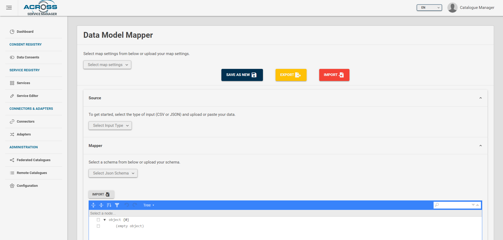
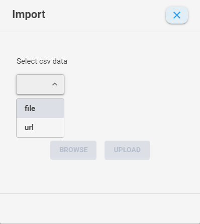
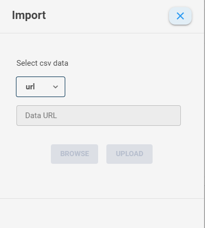
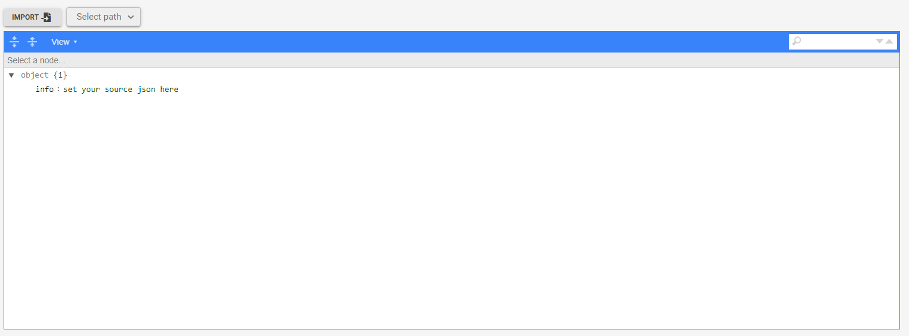
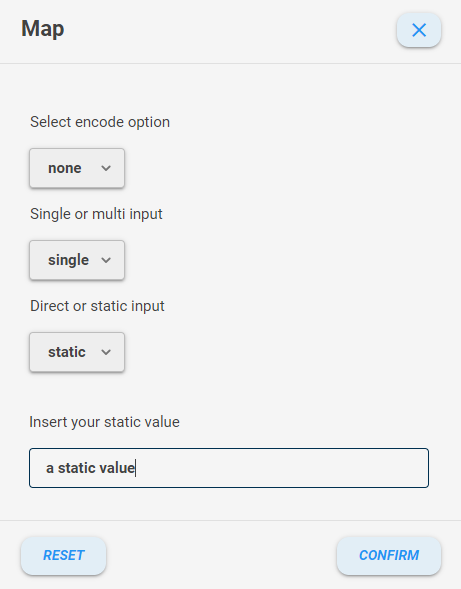
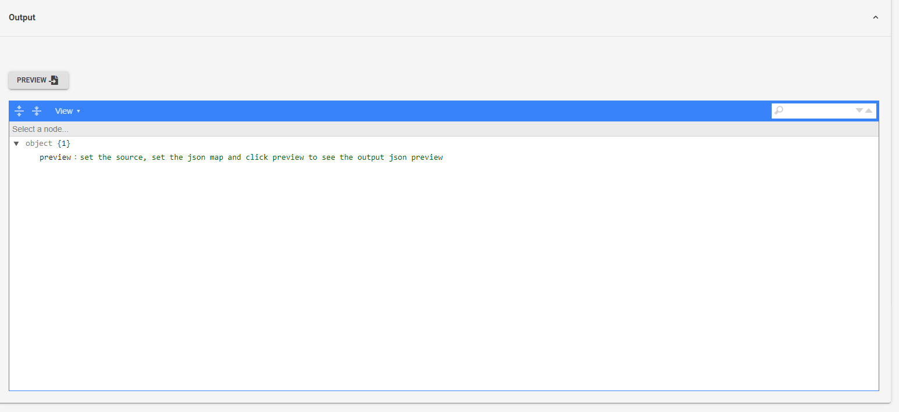
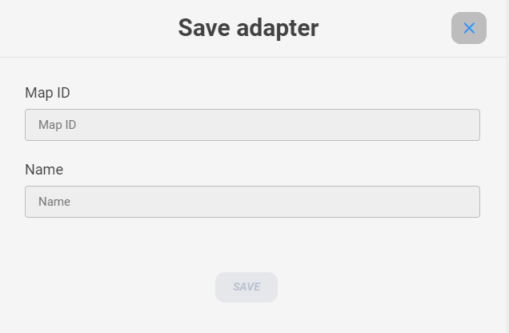
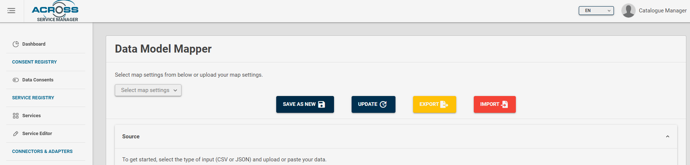
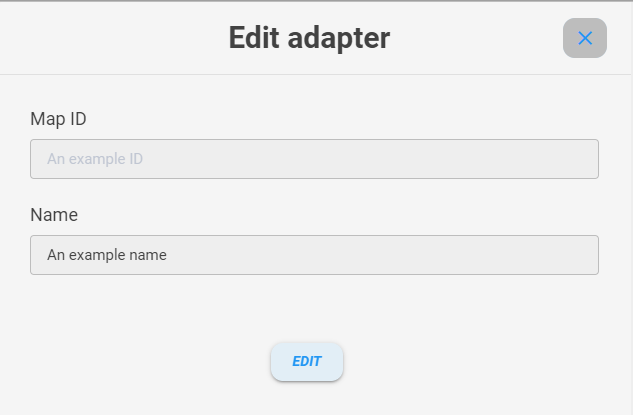

# Data model mapper GUI

## Introduction

The Data model mapper GUI is a graphic user interface for the Data model mapper.
The Data model mapper functionalities are explained in [Data model mapper Readme](../Readme.md)

## Service dashboard

The section **Home** is where you can save or edit mapper settings.

It contains the following accordion 

-   *Source*. Where you can set the source input
-   *Mapper*. Where you can set the mapper options
-   *Output*. Where you can see a preview of the mapped source

## Source

In the **Source** accordion you can import a source file or edit it.

Firstly, select the inout type source

For CSV input type, this it the source editor

You can either write your CSV data inside the textarea or import it by clicking the import button.
If you want to import it, click **IMPORT** button and a dialog will appear

By clicking on the select labeled **Select csv data** you can chose to import a source file from your PC 

or from a remote URL

If you select **URL** paste or write the URL in the *Data URL* input and click **UPLOAD**.

If you chose **file** then you have to click **BROWSE** button and select your file from the explorer window

Click **open** and then click **UPLOAD**

You'll see the textarea filled with your source file

If you prefer a table view, click on **CSV TABLE**

If your table is not formatted properly, you must change the colon separator with the one present in your source file

Then you'll see the CSV formatted in a table view

If you want to import or edit a JSON file, click on the input type select and chose JSON

You'll see a JSON editor

You can write your JSON code by clicking on **View**

and selecting **Code**

If you want to import it, the steps are the same as mentioned for CSV import.

If you select **View** instead of **Code** you will see the JSON formatted differently

Click on **Select path** and select the path where you want to start analyzing your source field and subfields in order to map them.

## Mapper

In this section you can set the map settings

You can import a schema if you want set automatically the skeleton of the output. Click **IMPORT** and the steps are the same as mentioned before for source imput. Same if you want to set it manually, just click **Tree** and then select **View**

this time, other 2 view features are available :

- *Tree*.  A tree like view, with a button near each field to easily map your subfield

- *Preview*.  A read only JSON map settings preview

**Code** and **View** are the same as source editor.

If you imported the schema or you selected it from the select menu, you can start mapping your output subfield.

If you selected **Code** you can write manually the mapper settings as explained in [Data model mapper Readme](../Readme.md).

If you selected **Tree** mode, you can click next to the key subfield , on the **value** input field, and you can manually map the subfield there by texting it. 

or you can click the button near the mapping subfield if you want to be guided by a dialog UI.
First click it

then click Map

and a dialog will appear and you can easily select the map options from a select menu.

- Under *Select encode option* you can select the encode option (select *none* if you don't want to encode your output subfield)

- Under *Select single or multi output* you can chose if you want to concatenate some input subfield and / or static values into an array or an output string (depending on the schema destination type). Allowed values are **Single** or **Multi**

- Under *Direct or static input* you can chose to pick the output value from a source subfield or from a static value. Allowed values are **Direct** or **Static**

According to your choises : 

- If you chose **Single** and **Direct** you'll see an input menu where you can select the source input subfield to pick for the desired mapped output subfield 

- If you chose **Single** and **Static** you'll see an input field where you can write a static value for the desired mapped output subfield 

- If you chose **Multi** and **Direct** you'll see an input menu where you can select the source input subfield to pick for the desired mapped output subfield, an **Add Element** button to add it to an array / string (according to destination schema subfield type) and an ouput preview that will be filled each time you click **Add Element** button

- If you chose **Multi** and **Static** you'll see an input field where you can write a static value for the desired mapped output subfield, an **Add Element** button to add it to an array / string (according to destination schema subfield type) and an ouput preview that will be filled each time you click **Add Element** button

Click **Confirm** to confirm your choices, **Reset** if you want to redo the mapping from the beginning (for the selected subfield)

You can also import a schema from Data model mapper DB by clicking **Select Json schema** and selecting the desired one

or import the entire map settings by clicking **IMPORT** on the top of the page

or by selecting it from the Data model mapper DB 

## Output

In this section you can see an ouptut preview (max 3 rows).

Click **PREVIEW** and you'll see the output preview in an JSON editor similar to the ones mentioned for the *Source* and *Mapper* accordion, but this time the available view options are **View** and **Preview**.

## Saving

If the Output preview is good, you can save the map or export it.

If you want to download map settings, just click **EXPORT** button.

If you want to save map settings into Data model mapper Database , click **SAVE AS NEW**.

A save dialog will appear.

Chose a univoque Map ID and a name for the map settings and then click save.

If you want to save an adapter on the Service catalogue database related to this map settings, you can click on **SAVE ALSO IN SERVICE CATALOGUE** and you'll see a dialogue similar to the dialog explained in [Usage](./index.md) in *Connectors and adapters section*

## Updating

If you want to update map settings, click on **UPDATE**  button

and an update dialog will appear.

You can just update the name. After finished, click **EDIT** button.
