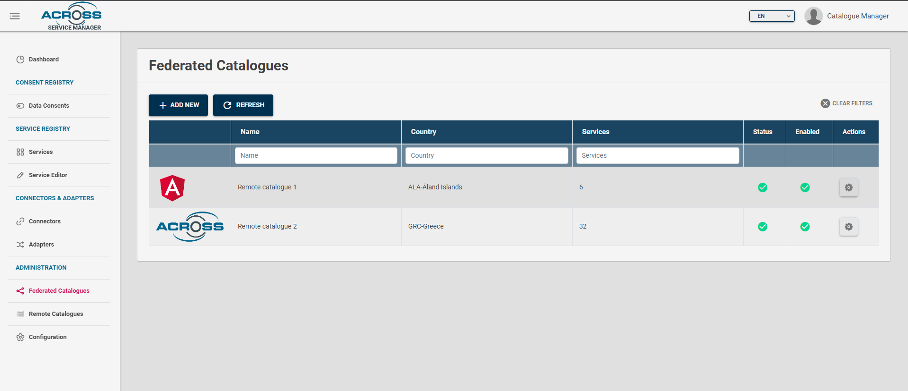
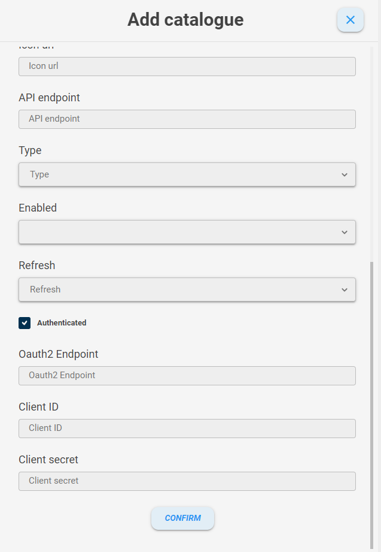
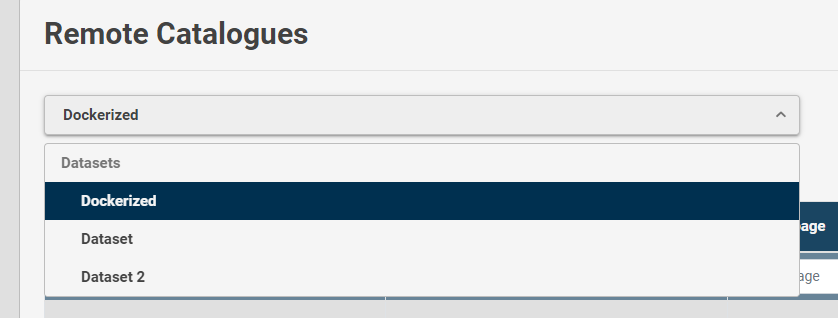

# How to federate a catalogue

## General Info

Federating a catalogue means enabling the possibility of retrieving a list of its services. 
A federation is an action available only for CATALOGUE_MANAGER type user.
There are two ways of federating a catalogue.

## Method 1

Go to the page \"Federated catalogues\" 

and click the add new button 

Fill the following fields: 

-   *Name*. A name of the catalogue.

-   *Competent authority*. The competent authority related to the catalogue (e.g \"Regione Sicilia\"...)

-   *Country*. The country where the catalogue is located and related to.

-   *Category*. the category to which the catalog belongs. The allowed values are `Municipality`, `Province`, `Private Institution`, `Public Body` and `Region`

-   *Description*. A description of the catalogue.

-   *Home page*. The home page of the site of the catalogue (e.g http://regionesicilia/service-catalogue).

-   *Icon URL*. The icon's URL address of the catalogue (e.g http://regionesicilia/service-catalogue-manager/assets/favicon.ico) This icon will be shown in the \"federated catalogues\" table.

-   *API endpoint*. The base URL of the remote service catalog server, without the /api/v2/* path (e.g http://regionesicilia.it/service-catalogue) if the type is `Service catalogue`. For `JSON` datasets insert the full URL address.

-   *Type*. The type of the catalogue. The allowed values are `Service catalogue` (a remote service catalogue server) and `Native` (a remote services list).

-   *Enabled*. If \"Enabled\" it will be shown in the list of remote catalogues in the Services table section. If \"Disabled\" it won't be shown in the list of remote catalogues in the Services table section. The allowed values are `Enabled` and `Disabled`.

-   *Refresh*. The refresh time of the catalogue. This is the interval after which the count of services of the remote catalogue will be updated. The allowed values are `Every day`, `Every week` and `Every month`.

-   *Authenticated*. This is a checkbox. If checked, the authentication fields will be showed (`oAuth2 endpoint`, `Client ID` and `Client secret`). Check this checkbox if the remote catalogue needs authentication params.

-   *oAuth2 endpoint*. The address URL used for oAuth2 authentication in the remote Service catalogue. This can be retrieved in the identity manager' page of the remote service catalogue (e.g. Keycloak page).

-   *Client ID*. A client ID is an authentication param required for oAuth2 authentication method. It can be retrieved in the identity manager' page of the remote service catalogue (e.g. Keycloak page).

-   *Client secret*. A client secret is an authentication param required for oAuth2 authentication method. It can be retrieved in the identity manager' page of the remote service catalogue (e.g. Keycloak page).

Then click the \"confirm\" button and a toast (notification) will be showed if the inserting catalogue process went fine, instead you'll see an error dialog.

## Method 2

A second way to federate a catalogue is selecting it from a remote catalogues list. If you do not have one, do the following steps.

Go to the page \"configurations\" and click the add new button. 

This will show a form where you can set the properties of a remote catalogue dataset, that is a remote source where you can retrieve a list of catalogues.

Fill the following fields: 

-   *Name*. A name of the dataset.

-   *Type*. The type of the dataset. The allowed values are `Service catalogue` (a remote service catalogue server) and `JSON` (a remote catalogues list in JSON format).

-   *URL*. The base URL of the remote service catalog server, without the /api/v2/* path (e.g http://regionesicilia.it/service-catalogue) if the type is `Service catalogue`. For `JSON` datasets insert the full URL address.

Click the \"confirm\" button. If the remote catalogue is reachable, you'll be able to insert it and a notification will be shown, instead you'll see an error dialog. 

Then go to the \"remote catalogues\" page 

and select from the list the name you chose for the dataset.

A catalogue list will appear in the table. 

Check the (+) button and click it. If everything went okay, a notification alert will inform you that the catalogue was federated.

Finally, if the catalogue needs authentication params, go to the page \"Federated catalogues\"

click the actions button and click \"edit\". 

An edit form will appear and you'll have to check the \"authenticated\" check box. Fill the `Client ID` and `Client secret` fields with authentication params as mentioned in Method 1.

Then click the \"confirm\" button and a toast (notification) will be showed if the editing catalogue process went fine, instead you'll see an error dialog.

**\*NOTES\*** Some fields are mandatory. An alert will inform you.
Watch the status of the datasets in the dataset table. If green, it's available. If red, there were errors retrieving remote catalogues list. 
In the federated catalogues table, the status can be green (available for queries and providing you its services list), yellow (not available for queries and providing you its services list) or red (not reachable).
If you have to change the `Client ID` and `Client secret` secret, you have to click the "\Reset client ID and secret\" button in edit mode.