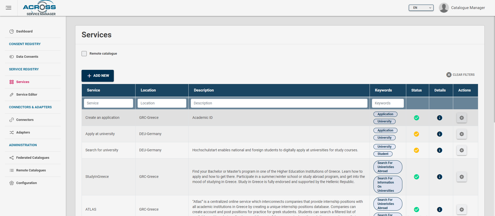
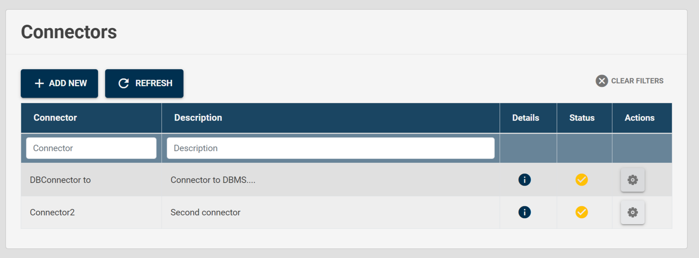

# Service Catalogue Manager Dashboard

## Introduction

The Service Manager is a multi-role, [Angular](https://angular.io/)
based admin dashboard implemented with the aim to include all module
sections to interact with Service Catalogue but at the same time,
according to the role of authenticated user, to manage the consents
registry as Data Controller.

The Service Manager uses
[Keycloak](https://www.keycloak.org/docs/latest/server_admin/) as
identity broker providing at login phase an extensible page to select
optional authentication systems.

In particular for eIDAS authentication, or national identity schemes, a
dedicated adapter could be implemented, brokered by Keycloak as identity
broker.

Once authenticated, the user according to the roles assigned by means of
Keycloak the user can access to several sections.

## Service dashboard

The section \"Dashboards\" provides and extensible page of graphical dashboard cards providing some summaries about the inserted services.

## Services section
 In this section user can view the list of already inserted services by having a first look
about their basic information (name, status, description\...), filter them, or to be redirected to the \"Details\" page.

From \"Actions\" the user can perform several actions in accordance with
the status of service

-   *Edit*. User can modify or complete service description, by entering
    in edit mode page

-   *Register*. This action changes the status of service description
    into \"completed\". Once completed the service is searchable, by
    means of APIs exposed by the Service Catalogue.

-   *Delete.* User can delete a service description. The action can be
    performed if the service is in the status of \"UnderDevelopment\" or
    after a de-registration.

-   *Export.* User can export the description of Service by selecting
    different formats: JSON, JSON-LD, CPSV-AP Model (json-ld)

-   *Publish.* By this action the Service Catalogue provides the
    availability to call a customizable publish action. It lets to
    publish externally the service description at all or some
    information.

-   *View Connector.* It lets to switch to the related connector page.

From the list page the user can add a new service description by clicking on \"Add new\" button. The user is redirected to Service Editor
page. 

## Service Description Editor section

The **Editor** section, reported in the figure below, let the Service Provider to define in a graphical way all the relevant fields and sections of a Service description:

- Basic Information
- Extended Service Information
- Service Instance Information
- Usage Rule Information
- Personal Data Handling Information

The service editor is composed in several tabs in relation to the Service model. Each property is documented with a brief description. 

See [Service Description section](../model/service-model.md) for further information about Service Description data model and [how to describe a Service](service-description-howto.md).

Service Provider can perform following operations on a Service Description Page:

  - Create from scratch.
  - Edit an existing Description from **Services** section of the Dashboard.
  - Save the description being edited to make it available in the **Services** Section.
  - Export a description being edited .
  - Import existing standard service models or non-standard/legacy descriptions by selecting the suitable registered service model adapter.

---
## Connectors & Adapters sections

The \"Connectors\" and "Adapters" sections provide quick information
about the registered connectors and their status and logs. From these
sections it is possible to edit their metadata or register new ones.

 
---
## Data Consents Section

The \"Data Consents\" page provides, if the authenticated user has
\"data-controller\" role, a registry of consents collected. It is a
front-end client of the APIs provided by the Consent Manager component
or if configured to be used with [CaPe
solution](https://github.com/OPSILab/Cape).

In this section the Dashboard provides a table where Service Provider can visualize both the overview and details of all the Consents given, for all registered Services Users.

Each row can be filtered out by following columns values:

 - Service name
 - Data Provider (Sink Service involved in the Consent)
 - User (Surrogate ID involved in the Consent)
 - Processing purpose of the Service (Sink service in case of Consent for data sharing between services)
 - Consent Status (Active, Disabled, Withdrawn)
 
 Clicking the (i) button, Consent details popup will appear showing the following information (if configured with CaPe):

 - **Purpose and Processing**: details on processing made by the Service (the single Service or the Sink one) involved in Consent (the same of its Service Description)
                           In particular, Data Concepts in the datasets being part of the generated Resource Set for that consent.
 
 - **Consent History**: history of the status and data concepts changes made by End User during Consent lifecycle.
 
 - **Consent hash and Notarization**: visualize the value of the JWS signature of that Consent Record, made with the private key of the Cape User Account.
                                       The Account's key public part (retrieved through Account Manager API) can be used with the Consent Record Payload to verify that signature.
 
 - **Consent raw data**: visualize the whole Consent Record in JSON format.									   
									   
									   