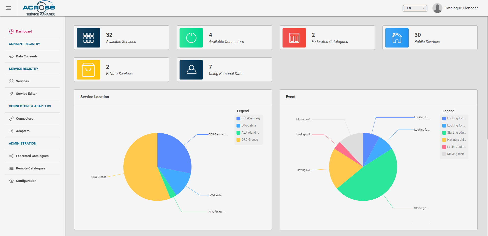
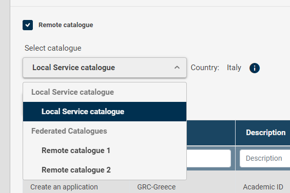
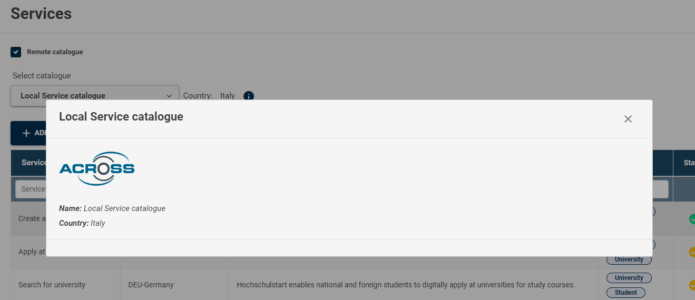
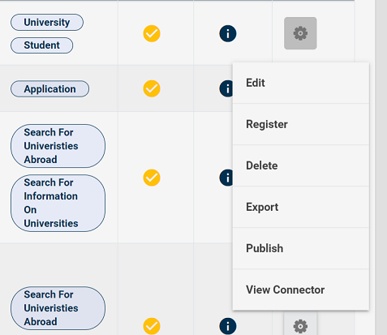
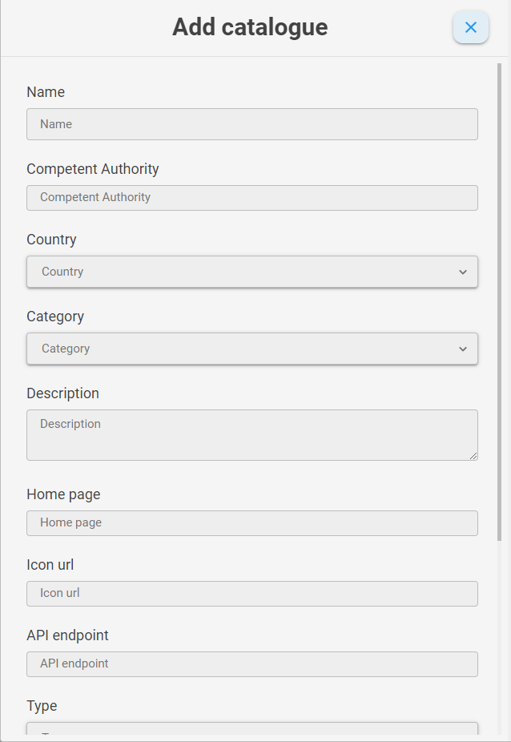
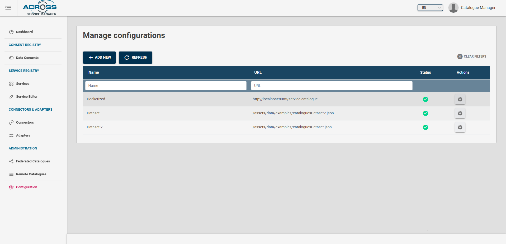

# Service Catalogue Manager Dashboard

## Introduction

The Service Manager is a multi-role, [Angular](https://angular.io/)
based admin dashboard implemented with the aim to include all module
sections to interact with Service Catalogue but at the same time,
according to the role of authenticated user, to manage the consents
registry as Data Controller.

The Service Manager uses
[Keycloak](https://www.keycloak.org/docs/latest/server_admin/) as
identity broker providing at login phase an extensible page to select
optional authentication systems.

In particular for eIDAS authentication, or national identity schemes, a
dedicated adapter could be implemented, brokered by Keycloak as identity
broker.

Once authenticated, the user according to the roles assigned by means of
Keycloak the user can access to several sections.

## Service dashboard

The section **Dashboards** provides and extensible page of graphical dashboard cards providing some summaries about the inserted services, connectors, adapter and catalogues.

## Services section
 In this section user can view the list of already inserted services by having a first look
about their basic information (name, status, description\...), filter them, or to be redirected to the **Details** page. 

The user can also choose a remote catalogue as source of services (see [Federation section](./federation-how-to.md) to know how to add other sources of services). If the **Remote catalogue** checkbox is checked and a remote catalogue source is selected, only services with status `COMPLETED` will be shown.

As clicked, the select list will appear

The info button , if clicked, will open a catalogue info dialog

From **Actions** the user can perform several actions in accordance with
the status of service

-   *Edit*. User can modify or complete service description, by entering
    in edit mode page

-   *Register*. This action changes the status of service description
    into **completed**. Once completed the service is searchable, by
    means of APIs exposed by the Service Catalogue.

-   *Delete.* User can delete a service description. The action can be
    performed if the service is in the status of **UnderDevelopment** or
    after a de-registration.

-   *Export.* User can export the description of Service by selecting
    different formats: JSON, JSON-LD, CPSV-AP Model (json-ld). 
    If the catalogue is remote, this is the only action available

-   *Publish.* By this action the Service Catalogue provides the
    availability to call a customizable publish action. It lets to
    publish externally the service description at all or some
    information.

-   *View Connector.* It lets to switch to the related connector page.

From the list page the user can add a new service description by clicking on **Add new** button. The user is redirected to Service Editor
page. 

## Service Description Editor section

The **Editor** section, reported in the figure below, let the Service Provider to define in a graphical way all the relevant fields and sections of a Service description:

- Basic Information
- Extended Service Information
- Service Instance Information
- Usage Rule Information
- Personal Data Handling Information

The service editor is composed in several tabs in relation to the Service model. Each property is documented with a brief description. 

See [Service Description section](../model/service-model.md) for further information about Service Description data model and [how to describe a Service](service-description-howto.md).

Service Provider can perform following operations on a Service Description Page:

  - Create from scratch.
  - Edit an existing Description from **Services** section of the Dashboard.
  - Save the description being edited to make it available in the **Services** Section.
  - Export a description being edited .
  - Import existing standard service models or non-standard/legacy descriptions by selecting the suitable registered service model adapter.

---
## Connectors & Adapters sections

The **Connectors** and "Adapters" sections provide quick information
about the registered connectors and their status and logs. From these
sections it is possible to edit their metadata or register new ones.

This is the connectors table

By clicking the add new button , a form with connector fields will appear and, when each required field is set by the user, a click on the confirm button will save the connector

From **Actions** the user can perform several actions in accordance with
the status of connector

-   *Edit*. User can modify or complete connector description, by showing 
    the edit connector form dialog

-   *Register*. This action changes the status of connector description
    into **active**. 

-   *Delete.* User can delete a connector description. The action can be
    performed if the service is in the status of **inactive** or
    after a de-registration.

This is the adapters table

By clicking the add new button , a form with adapter fields will appear and, when each required field is set by the user, a click on the confirm button will save the adapter

From **Actions** the user can perform several actions in accordance with
the status of connector

-   *Edit*. User can modify or complete adapter description, by showing 
    the edit adapter form dialog

-   *Register*. This action changes the status of adapter description
    into **active**. 

-   *Delete.* User can delete a adapter description. The action can be
    performed if the service is in the status of **inactive** or
    after a de-registration.

In  you can find an explanation on how to save an adapter both in Data model mapper database and in Service catalogue database.

---

## Administration section

The **Administration** section provides sections to manage the available list of remote catalogues and their federation(see [Federation section](./federation-how-to.md) to know what is a federated catalogue and how to federate a catalogue).
This section is available only for CATALOGUE_MANAGER type user.
There are three pages in this section:

-   *Federate catalogues*

-   *Remote catalogues*

-   *Configuration*

## Federated catalogues page

This is a page showing federated catalogues where federated query can be done in order to obtain remote services list

By clicking the add new button , a form with catalogue fields will appear and, when each required field is set by the user, a click on the confirm button will save the catalogue

You'll see these fields : 

-   *Name*. A name of the catalogue.

-   *Competent authority*. The competent authority related to the catalogue.

-   *Country*. The country where the catalogue is located and related to.

-   *Category*. the category to which the catalog belongs.

-   *Description*. A description of the catalogue.

-   *Home page*. The home page of the site of the catalogue.

-   *Icon URL*. The icon's URL address of the catalogue.

-   *API endpoint*. The base URL of the remote service catalog server.

-   *Type*. The type of the catalogue. .

-   *Enabled*. If **Enabled** it will be shown in the list of remote catalogues in the Services table section.

-   *Refresh*. The refresh time of the catalogue. .

-   *Authenticated*. This is a checkbox. If checked, the authentication fields will be shown.

-   *oAuth2 endpoint*. The address URL used for oAuth2 authentication in the remote Service catalogue.

-   *Client ID*. A client ID is an authentication param required for oAuth2 authentication method.

-   *Client secret*. A client secret is an authentication param required for oAuth2 authentication method.

From **Actions** the user can perform several actions in accordance with
the status of catalogue

-   *Edit*. User can modify or complete adapter description, by showing 
    the edit catalogue form dialog

-   *Enable*. This action changes the status of catalogue description
    into **enabled**. 

-   *Disable*. This action changes the status of catalogue description
    into **disabled**. 

-   *Delete.* User can delete a catalogue description. The action can be
    performed if the service is in the status of **disabled**.

-   *Download metadata.* User can download the catalogue description.

-   *Refresh.* Refresh the catalogue status.

 ## Remote catalogues page 

 This is a page showing remote catalogues that can be federated. 

 

 A select list shows the list of dataset containing the catalogues showed in the list

 

 This is the federate button , that federate the catalogue in order to obtain its service list by federated queries

 

 ## Configuration page 

 In this page , datasets containing a list of catalogues can be added to the service catalogue.

 

By clicking the add new button , a form with dataset fields will appear and, when each required field is set by the user, a click on the confirm button will save the catalogue

From **Actions** the user can perform two actions

-   *Edit*. User can modify or complete dataset description, by showing 
    the edit dataset form dialog

-   *Delete.* User can delete a dataset description.

---

## Data Consents Section

The **Data Consents** page provides, if the authenticated user has
**data-controller** role, a registry of consents collected. It is a
front-end client of the APIs provided by the Consent Manager component
or if configured to be used with [CaPe
solution](https://github.com/OPSILab/Cape).

In this section the Dashboard provides a table where Service Provider can visualize both the overview and details of all the Consents given, for all registered Services Users.

Each row can be filtered out by following columns values:

 - Service name
 - Data Provider (Sink Service involved in the Consent)
 - User (Surrogate ID involved in the Consent)
 - Processing purpose of the Service (Sink service in case of Consent for data sharing between services)
 - Consent Status (Active, Disabled, Withdrawn)

 Clicking the (i) button, Consent details popup will appear showing the following information (if configured with CaPe):

 - **Purpose and Processing**: details on processing made by the Service (the single Service or the Sink one) involved in Consent (the same of its Service Description)
                           In particular, Data Concepts in the datasets being part of the generated Resource Set for that consent.

 - **Consent History**: history of the status and data concepts changes made by End User during Consent lifecycle.

 - **Consent hash and Notarization**: visualize the value of the JWS signature of that Consent Record, made with the private key of the Cape User Account.
                                       The Account's key public part (retrieved through Account Manager API) can be used with the Consent Record Payload to verify that signature.

 - **Consent raw data**: visualize the whole Consent Record in JSON format.									   
									   
									   