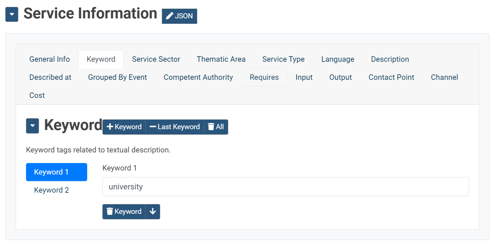
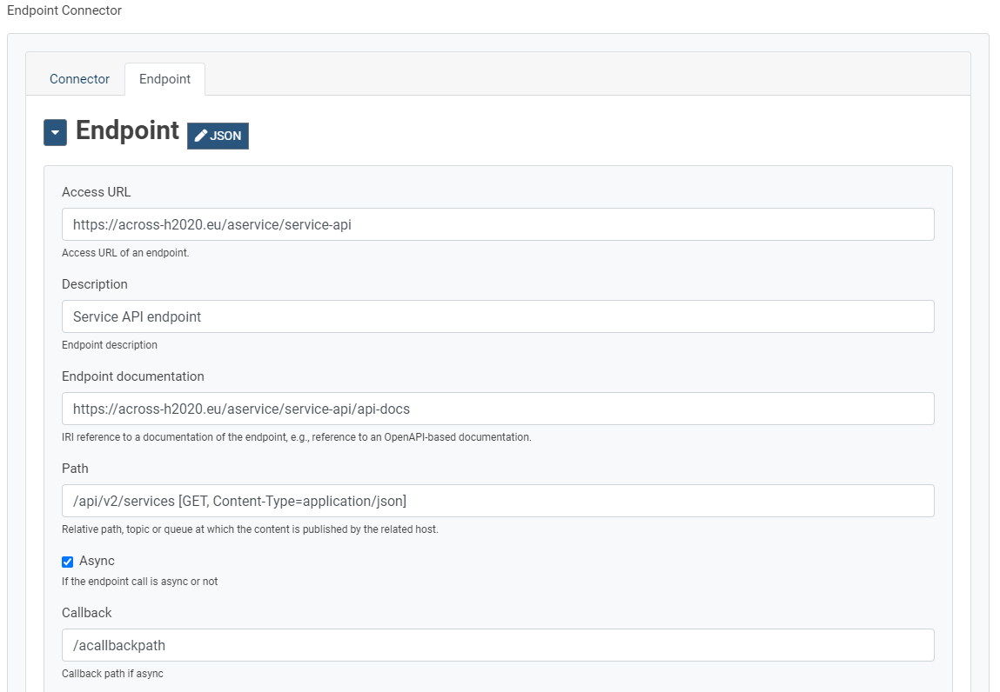
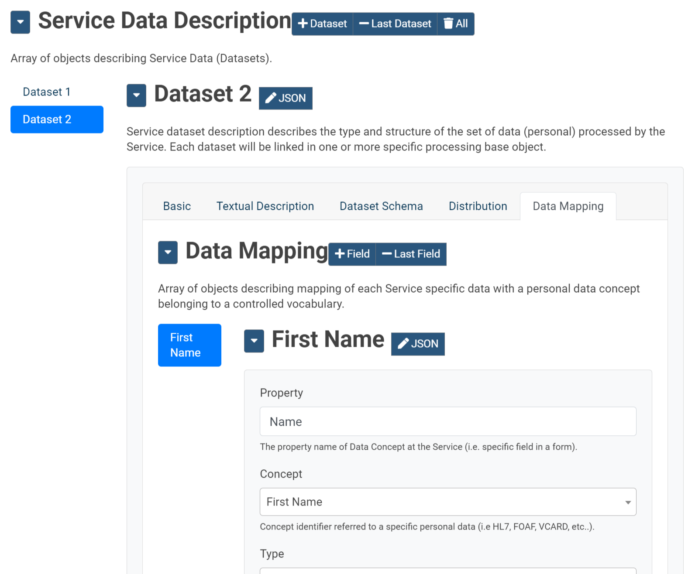

# How to describe a service

## General Info

To describe a new service by means of Service Catalogue Editor go to
"Services" and clicks on "Add new"


You will redirect to the Service Editor page showing you several tabs
where you can provide information about the service:

-   Service overall information

-   Service instance information

-   Service Personal Data handling information.

You can find the complete description of Service Model here.

Go to ***Catalogue Info*** tab and insert mandatory information:

-   Service Name

-   Service Identifier

Select as optional if the service is Public or not ( by default Yes):


## Service Information

In ***Service Information*** tab you can insert a set of information
compliant to CSPV-AP Public Service model. The properties "Identifier"
and "Name" have been filled automatically with the values inserted in
the previous tab


Insert *Spatial* and *Processing Time* if you want provide information
about the time needed for executing the services and if you want that
the Services could be filtered by location. Duration should be inserted
by using the ISO8601 syntax *P(n)Y(n)M(n)W(n)DT(n)H(n)M(n)S* (e.g P1Y is
one year duration)

**\*NOTES\*** Several fields are mandatory or have syntax constrains. An
alert will inform you.

In **Keyword** tab provide one or more keywords if you want that the
Services could be filtered/searchable by a set of keywords. Local keywords (only for infomation point of view)
can be added in each description class.



Select one more "Sector", "Thematic" and "Type" and "Event" categories
if you want categorize your service description.


To provide multilanguage descriptions first of all select the available
languages from **Language** tab


To provide further external information use the tab "Described at"


Compile **Competent Authority** and **Contact Point** tabs for
information how to contact/reach the agent providing the service.


A service could require several other services. Use the tab **Requires**
to provide a list of required services. From this tab you can select one
or more registered services in the catalogue or to put a reference (e.g
the url) to an external service.


By means of **Channel** tab you can provide information about the
several channels through which an Agent provides, uses or otherwise
interacts with the Public Service, such as an online service, phone
number or office.


According to the type of channel other information should be included in
order to access the service ( e.g Contact point or Competent Authority
info). In particular if *RESTService* is selected several information
should be provided into **Service Instance** tab.

Each channel can be associated with several inputs defined previously in
**Input** tab


For each input several reference information can be provided and in
particular the specification (**Conforms to** tab) of Dataset defined in
**Service Instance** tab.


In tab **Cost** the user can provide information about the cost of provision and in case for which selected channel.


## Service Instance

The **Service Instance** tab collects all information on the specific
service instance invocable at the endpoint filled in the "Endpoint"
section



## Personal Data Handling

The **Personal Data Handling** tab collects all information about the
personal data processing for specific purposes by referring the datasets
defined in Service Instance section.


The following section provides an example of what information should be
included for a rest service invocation as alternative to use the
information included in endpoint documentation and related connection
with personal data handling section.

## Example: service invocation information

The minimum set of information needed to invoke a service:

it will use the info provided in the following pages, to invoke the REST
services:

-   *Service Instance-\>Endpoint Connector-\>Endpoint section*

-   *Service Instance-\>Service Data Description-\>Basic section*

-   *Service Instance-\>Service Data Description-\>Data Mapping section*


Endpoint properties:

-   Access URL- root url of REST endpoint

-   Endpoint documentation url (e.g an openapi doc)

-   Path- Relative path of the specific endpoint \[{METHOD},
    Content-Type:{content-type}\]

    -   METHOD = GET/POST/PUT

    -   Content-type:

        -   Application/json

        -   Multipart/form-data, where eachpart could be a string or a
            file (Content-Type=application/octet-stream), depending on
            how it has been defined in Service Instance-\>Service Data
            Description-Data Mapping
  - Asynch - if it is a REST asynchronous call
  - Callback - any path or url of callback function associated to the asynchronous call


Create separate datasets by distinguishing personal data and not.
Personal dataset are used to specify which property requires data
consent as defined in *Personal Data Handling-\>Required Datasets*




In **Data Mapping** tab the inputs to the REST service are defined. The
following values are used:

-   Property- the input identifier to be used when invoking the REST
    service

-   Type- possible values recognised for invoking the REST service:

    -   Input text

    -   File

    -   other options if configured in enumerated list of [**Service Model**](../model/service-model.md)

-   Required: true/false

-   Concept: (if personal data)personal data concept

-   Input Type - input form type ( text input, select, ..). In the selectbox you can select one of the HTML5 input types.

-   Source - it is possible assign a previously defined *Distribution* class which refers to an external enumerate list of possible values


- ReadOnly - Set at true if the property is readonly and/or prefilled by connecting to an integrated datasource/wallet/external service. In the last case you can map it with a specific propertyin the following Datamap field.

- DataMap - the map of the property with an existing property of the available wallet or other Once-Only data attributes. By default you can select the eIDAS Profile attributes for Natual and Legal Person. To extend the available attributes schemas update the references of Dataset class (see [**Service Model Extension**](../model/service-model.md#service-model-extension))


## JSON Example

Below an json example of service description with almost example properties described in the previous section. You can copy it and paste it in the **Service Editor** page:


or save as file and import as described  in the *service import* section [here](index.md)

```
{
  "title": "Service for TD testing 2",
  "identifier": "992c3775-c79d-4d9d-9219-3b4166de34f9",
  "issued": "",
  "createdByUserId": "service.manager",
  "versionInfo": "1.0",
  "serviceIconUrl": "",
  "status": "UnderDevelopment",
  "isPublicService": true,
  "hasInfo": {
    "identifier": "992c3775-c79d-4d9d-9219-3b4166de34f9",
    "title": "Service for TD testing 2",
    "status": "UnderDevelopment",
    "keyword": [
      "application",
      "university"
    ],
    "sector": [
      "P - Education",
      "P85.4 - Higher education"
    ],
    "thematicArea": [],
    "type": [],
    "language": [],
    "description": [
      {
        "locale": "",
        "description": "Create an application",
        "title": "",
        "keyword": []
      }
    ],
    "isDescribedAt": [],
    "processingTime": "",
    "isGroupedBy": [
      "Having a child",
      "Starting education"
    ],
    "hasCompetentAuthority": {
      "identifier": "",
      "title": "",
      "hasAddress": "",
      "prefLabel": "",
      "spatial": ""
    },
    "requires": [],
    "spatial": "GRC-Greece",
    "hasInput": [
      {
        "identifier": "firstname",
        "title": "First name",
        "description": [
          {
            "locale": "",
            "title": "",
            "description": "First name"
          }
        ],
        "type": [],
        "language": [
          "en"
        ],
        "page": [],
        "conformsTo": []
      },
      {
        "identifier": "lastname",
        "title": "Last name",
        "description": [
          {
            "locale": "",
            "title": "",
            "description": "Last name"
          }
        ],
        "type": [],
        "language": [
          "en"
        ],
        "page": [],
        "conformsTo": []
      },
      {
        "identifier": "username",
        "title": "Username",
        "description": [
          {
            "locale": "",
            "title": "",
            "description": "User name"
          }
        ],
        "type": [],
        "language": [
          "en"
        ],
        "page": [],
        "conformsTo": []
      },
      {
        "identifier": "street",
        "title": "Street",
        "description": [
          {
            "locale": "",
            "title": "",
            "description": "Street"
          }
        ],
        "type": [],
        "language": [
          "en"
        ],
        "page": [],
        "conformsTo": []
      },
      {
        "identifier": "zipCode",
        "title": "Zip code",
        "description": [
          {
            "locale": "",
            "title": "",
            "description": "Zip code"
          }
        ],
        "type": [],
        "language": [
          "en"
        ],
        "page": [],
        "conformsTo": []
      },
      {
        "identifier": "city",
        "title": "City",
        "description": [
          {
            "locale": "",
            "title": "",
            "description": "City"
          }
        ],
        "type": [],
        "language": [
          "en"
        ],
        "page": [],
        "conformsTo": []
      },
      {
        "identifier": "state",
        "title": "State",
        "description": [
          {
            "locale": "",
            "title": "",
            "description": "State"
          }
        ],
        "type": [],
        "language": [
          "en"
        ],
        "page": [],
        "conformsTo": []
      },
      {
        "identifier": "country",
        "title": "Country",
        "description": [
          {
            "locale": "",
            "title": "",
            "description": "Country"
          }
        ],
        "type": [],
        "language": [
          "en"
        ],
        "page": [],
        "conformsTo": []
      },
      {
        "identifier": "password",
        "title": "Password",
        "description": [
          {
            "locale": "",
            "title": "",
            "description": "Password"
          }
        ],
        "type": [],
        "language": [
          "en"
        ],
        "page": [],
        "conformsTo": []
      },
      {
        "identifier": "institution",
        "title": "Institution",
        "description": [
          {
            "locale": "",
            "title": "",
            "description": "Institution"
          }
        ],
        "type": [],
        "language": [
          "en"
        ],
        "page": [],
        "conformsTo": []
      },
      {
        "identifier": "email",
        "title": "Email",
        "description": [
          {
            "locale": "",
            "title": "",
            "description": "Email"
          }
        ],
        "type": [],
        "language": [
          "en"
        ],
        "page": [],
        "conformsTo": []
      },
      {
        "identifier": "mobile",
        "title": "Mobile",
        "description": [
          {
            "locale": "",
            "title": "",
            "description": "Mobile"
          }
        ],
        "type": [],
        "language": [
          "en"
        ],
        "page": [],
        "conformsTo": []
      },
      {
        "identifier": "academicStatus",
        "title": "Academic Status",
        "description": [
          {
            "locale": "",
            "title": "",
            "description": "Academic Status"
          }
        ],
        "type": [],
        "language": [
          "en"
        ],
        "page": [],
        "conformsTo": []
      },
      {
        "identifier": "department",
        "title": "Department",
        "description": [
          {
            "locale": "",
            "title": "",
            "description": "Department"
          }
        ],
        "type": [],
        "language": [
          "en"
        ],
        "page": [],
        "conformsTo": []
      },
      {
        "identifier": "registrationNumber",
        "title": "Registration Number",
        "description": [
          {
            "locale": "",
            "title": "",
            "description": "Registration Number"
          }
        ],
        "type": [],
        "language": [
          "en"
        ],
        "page": [],
        "conformsTo": []
      },
      {
        "identifier": "studentNo",
        "title": "Student Number",
        "description": [
          {
            "locale": "",
            "title": "",
            "description": "Student Number"
          }
        ],
        "type": [],
        "language": [
          "en"
        ],
        "page": [],
        "conformsTo": []
      },
      {
        "identifier": "SSN",
        "title": "SSN",
        "description": [
          {
            "locale": "",
            "title": "",
            "description": ""
          }
        ],
        "type": [],
        "language": [
          "en"
        ],
        "page": [],
        "conformsTo": []
      },
      {
        "identifier": "firstRegistrationMonth",
        "title": "First Registration Month",
        "description": [
          {
            "locale": "",
            "title": "",
            "description": ""
          }
        ],
        "type": [],
        "language": [
          "en"
        ],
        "page": [],
        "conformsTo": []
      },
      {
        "identifier": "firstRegistrationYear",
        "title": "First Registration Year",
        "description": [
          {
            "locale": "",
            "title": "",
            "description": ""
          }
        ],
        "type": [],
        "language": [
          "en"
        ],
        "page": [],
        "conformsTo": []
      },
      {
        "identifier": "distributionPoint",
        "title": "Distribution Point",
        "description": [
          {
            "locale": "",
            "title": "",
            "description": ""
          }
        ],
        "type": [],
        "language": [
          "en"
        ],
        "page": [],
        "conformsTo": []
      }
    ],
    "produces": [],
    "hasContactPoint": {
      "email": "webmaster@daad.de",
      "faxNumber": "",
      "telephone": "+49 228 882-0",
      "url": "https://academicid-academicid-dev.k8s.across-h2020.eu",
      "identifier": "",
      "openingHours": "",
      "hoursAvailable": ""
    },
    "hasChannel": [
      {
        "identifier": "",
        "type": "RESTService",
        "openingHours": "",
        "hoursAvailable": "",
        "hasInput": []
      }
    ],
    "hasCost": []
  },
  "hasServiceInstance": {
    "serviceProvider": {
      "businessId": "servProv1",
      "name": "TECNALIA",
      "hasAddress": "",
      "postalcode": "",
      "city": "",
      "state": "",
      "country": "",
      "email": "",
      "telephone": "",
      "jurisdiction": ""
    },
    "endpointConnector": {
      "endpoint": {
        "accessURL": "http://academicid-academicid-dev.k8s.across-h2020.eu",
        "endpointInformation": "",
        "endpointDocumentation": "",
        "path": "/applications/create [POST, Content-Type:application/json]",
        "async": false,
        "callback": ""
      },
      "connectorId": "connector1"
    },
    "dataset": [
      {
        "identifier": "dataset1",
        "description": [],
        "datasetSchema": {
          "context": "",
          "type": "",
          "id": ""
        },
        "dataStructureSpecification": "",
        "distribution": [],
        "dataMapping": [
          {
            "property": "academicStatus",
            "conceptId": "personal_details_highest_degree_received",
            "name": "Highest Degree Received",
            "type": "text",
            "inputType": "input text",
            "required": false,
            "source": "",
            "readonly": false,
            "datamap": ""
          },
          {
            "property": "lastname",
            "conceptId": "preferred_last_name",
            "name": "Last Name",
            "type": "text",
            "inputType": "input text",
            "required": true,
            "source": "",
            "readonly": true,
            "datamap": "CurrentFamilyName"
          },
          {
            "property": "street",
            "conceptId": "previous_address_street",
            "name": "Street Address 1",
            "type": "text",
            "inputType": "input text",
            "required": true,
            "source": "",
            "readonly": false,
            "datamap": ""
          },
          {
            "property": "zipCode",
            "conceptId": "previous_address_zip_code",
            "name": "Postal Code",
            "type": "text",
            "inputType": "input text",
            "required": true,
            "source": "",
            "readonly": false,
            "datamap": ""
          },
          {
            "property": "city",
            "conceptId": "previous_address_city",
            "name": "City",
            "type": "text",
            "inputType": "input text",
            "required": true,
            "source": "",
            "readonly": false,
            "datamap": ""
          },
          {
            "property": "state",
            "conceptId": "previous_address_state",
            "name": "State",
            "type": "text",
            "inputType": "input text",
            "required": true,
            "source": "",
            "readonly": false,
            "datamap": ""
          },
          {
            "property": "country",
            "conceptId": "previous_address_country",
            "name": "Country",
            "type": "text",
            "inputType": "input text",
            "required": true,
            "source": "",
            "readonly": false,
            "datamap": ""
          },
          {
            "property": "firstname",
            "conceptId": "preferred_first_name",
            "name": "First Name",
            "type": "text",
            "inputType": "input text",
            "required": true,
            "source": "",
            "readonly": false,
            "datamap": ""
          },
          {
            "property": "username",
            "conceptId": "account_logins_user_name",
            "name": "Username/Email",
            "type": "text",
            "inputType": "input text",
            "required": true,
            "source": "",
            "readonly": false,
            "datamap": ""
          },
          {
            "property": "password",
            "conceptId": "account_logins_password",
            "name": "Password",
            "type": "text",
            "inputType": "input text",
            "required": true,
            "source": "",
            "readonly": false,
            "datamap": ""
          },
          {
            "property": "email",
            "conceptId": "personal_email",
            "name": "Email",
            "type": "text",
            "inputType": "input text",
            "required": true,
            "source": "",
            "readonly": false,
            "datamap": ""
          },
          {
            "property": "mobile",
            "conceptId": "phone_number",
            "name": "Phone Number",
            "type": "text",
            "inputType": "input text",
            "required": true,
            "source": "",
            "readonly": false,
            "datamap": ""
          },
          {
            "property": "institution",
            "conceptId": "schoole_name",
            "name": "School Name",
            "type": "text",
            "inputType": "input text",
            "required": true,
            "source": "",
            "readonly": false,
            "datamap": ""
          },
          {
            "property": "department",
            "conceptId": "schoole_name",
            "name": "School Name",
            "type": "text",
            "inputType": "input text",
            "required": true,
            "source": "",
            "readonly": false,
            "datamap": ""
          },
          {
            "property": "registrationNumber",
            "conceptId": "identification_number",
            "name": "Identification Number",
            "type": "text",
            "inputType": "input text",
            "required": true,
            "source": "",
            "readonly": false,
            "datamap": ""
          },
          {
            "property": "studentNo",
            "conceptId": "identification_number",
            "name": "Identification Number",
            "type": "text",
            "inputType": "input text",
            "required": true,
            "source": "",
            "readonly": false,
            "datamap": ""
          },
          {
            "property": "ssn",
            "conceptId": "personal_details_identifying_information",
            "name": "Identifying Information",
            "type": "text",
            "inputType": "input text",
            "required": true,
            "source": "",
            "readonly": false,
            "datamap": ""
          },
          {
            "property": "firstRegistrationMonth",
            "conceptId": "rental_start_date.month",
            "name": "Start Date Month",
            "type": "text",
            "inputType": "input text",
            "required": true,
            "source": "",
            "readonly": false,
            "datamap": ""
          },
          {
            "property": "firstRegistrationYear",
            "conceptId": "rental_start_date.year",
            "name": "Start Date Year",
            "type": "text",
            "inputType": "input text",
            "required": true,
            "source": "",
            "readonly": false,
            "datamap": ""
          },
          {
            "property": "distributionPoint",
            "conceptId": "document_location",
            "name": "Document Location",
            "type": "text",
            "inputType": "input text",
            "required": true,
            "source": "",
            "readonly": false,
            "datamap": ""
          }
        ]
      }
    ],
    "serviceUrls": {
      "libraryDomain": "",
      "loginUri": "",
      "linkingRedirectUri": "",
      "objectionUri": "",
      "notificationUri": ""
    },
    "dataController": {
      "piiController": "John Doe 2",
      "organizationName": "TEC",
      "hasContact": "",
      "hasAddress": "",
      "email": "johndoe2@example.com",
      "telephone": "+385556",
      "operatorName": ""
    }
  },
  "hasUsageRule": [],
  "isPersonalDataHandling": [
    {
      "purposeId": "purpose1",
      "purposeName": "InterestProfile",
      "legalBasis": "Consent",
      "purposeCategory": "AcademicResearch",
      "hasSector": [
        "P - Education"
      ],
      "hasContext": [],
      "processingCategories": [
        "Acquire"
      ],
      "description": [
        {
          "locale": "",
          "title": "",
          "description": "This purpose enables to enhance the Apply for university service",
          "descriptionUrl": "",
          "iconUrl": ""
        }
      ],
      "hasPersonalDataCategory": [
        "PhysicalAddress",
        "School"
      ],
      "requiredDatasets": [
        "dataset1"
      ],
      "storage": {
        "location": "Controller servers",
        "duration": "Business practices"
      },
      "recipients": [
        "Ours"
      ],
      "shareWith": [
        {
          "orgName": "Optional Organization",
          "orgUrl": "http://example2.com",
          "businessType": "Profit",
          "required": false
        }
      ],
      "obligations": [
        {
          "event": "Consent revoked",
          "activity": "Stop processing"
        }
      ],
      "policyRef": "http://example2.com/policy",
      "collectionMethod": "Automatic aggregation",
      "collectionOperator": "",
      "termination": ""
    }
  ]
}


```